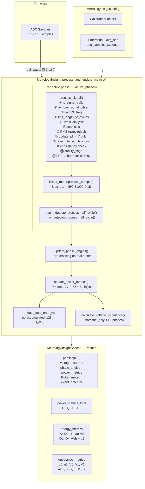
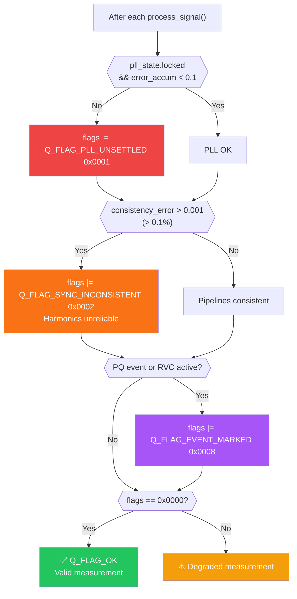

```mermaid
flowchart TD
    A["Firmware deposits\nphases[i].voltage.real_wave\nphases[i].current.real_wave"] --> B["process_and_update_metrics()"]
    B --> LOOP["For each phase 0..active_phases"]
    
    subgraph PHASE["Per-phase processing (V then I)"]
        direction TB
        P1["process_signal(target, ref_freq, delay, config, cache)"]
        P2{{"is_signal_valid?\nAmplitude ≥ config.min_amplitude"}}
        P3["remove_signal_offset()"]
        P4["calculate_zero_crossing_freq()\n(only if calc_freq=true)"]
        P5["limit_length_to_cycles()"]
        P6["UrmsHalfCycle per sample\n→ half_cycle_trigger at ZC"]
        P7["calculate_rms()\nTrapezoidal + fraction"]
        P8{{"Is it voltage?"}}
        P9["update_pll()\nDPLL + PI + VCO"]
        P10["resample_synchronous_into()\n512 pts · 10 cycles"]
        P11["Consistency check\nconsistency_error"]
        P12["quality_flags"]
        P13["If sync_len≥512:\ncompute_harmonics_and_thd()\nFFT → bins → THD"]
        P14["update_average()\nrms, peak, harmonics, thd"]
        
        P1 --> P2
        P2 -- No --> SKIP["Signal ignored"]
        P2 -- Yes --> P3 --> P4 --> P5 --> P6 --> P7 --> P8
        P8 -- Yes --> P9 --> P10
        P8 -- No --> P10
        P10 --> P11 --> P12 --> P13 --> P14
    end

    LOOP --> PHASE

    PHASE --> FLICKER["flicker_meter.process_sample()\nIEC 61000-4-15 Blocks 1-4"]
    FLICKER --> EVT["event_detector.process_half_cycle()\n+ rvc_detector.process_half_cycle()"]
    EVT --> QF["quality_flags |= Q_FLAG_EVENT_MARKED\n(if event active)"]

    QF --> NEXT["Next phase"]
    NEXT -->|"last phase"| ANG["update_phase_angles()\nZC → φ = θI − θV"]
    ANG --> POW["update_power_metrics()\nP=mean(VI) Q=S·sin(φ)"]
    POW --> EN["update_total_energy()\nAccumulate µJ by quadrant"]
    EN --> UB["If ≥3 phases:\ncalculate_voltage_unbalance()\n+ calculate_current_unbalance()\nFortescue V/I"]
```

# Metrology Insight — Complete Technical Documentation

## Index

1. [Overview](#1-overview)
2. [System Architecture](#2-system-architecture)
3. [Processing Pipeline](#3-processing-pipeline)
4. [Modules](#4-modules)
5. [System Constants](#5-system-constants)
6. [Quality Flags](#6-quality-flags)
7. [Features and Portability](#7-features-and-portability)
8. [Firmware Integration Guide](#8-firmware-integration-guide)
9. [Dependencies](#9-dependencies)

---

## 1. Overview

`metrology_insight` is a high-performance electrical metrology library for multi-platform embedded systems, designed to meet **IEC 61000-4-30:2021 Class S** and **IEC 62053-21** requirements.

> [!NOTE]
> **IEC Compliance Scope:** The library provides full software-level implementation for Class S Power Quality measurement methods (IEC 61000-4-30:2021), Flickermeter processing (IEC 61000-4-15), and 4-Quadrant active/reactive energy metering (IEC 62053-21 / IEC 62053-23).

It provides a complete electrical signal processing pipeline from raw ADC samples (`f32`) to grid quality metrics: RMS, active/reactive/apparent power, power factor, harmonics up to order 50, THD, quadrant energy (kWh), phase angles, Pst/Plt flicker (IEC 61000-4-15), event detection (Dip/Swell/Interruption), rapid voltage changes (RVC), Fortescue symmetrical components unbalance, and quality flags.

**Key features:**

- Support for 1 to 4 phases (single-phase, single-phase with neutral, 3-wire three-phase, 4-wire three-phase)
- High-inertia PLL (Phase-Locked Loop) for accurate frequency tracking (IEC 61000-4-30 §5.1)
- Synchronous resampling via linear interpolation over 10 cycles (512 points)
- FFT over 10 synchronous cycles with `realfft` (512 points)
- Flickermeter IEC 61000-4-15: Blocks 1–4 with IIR filters + weighting, logarithmic histogram for Pst and Plt calculation
- Quality event detector (Dip/Swell/Interruption) with half-cycle hysteresis (EN 50160)
- Rapid voltage change (RVC) detector with EMA steady-state tracking
- Fortescue symmetrical components for unbalance (u2, u0)
- Energy accumulators in micro-Joules (i128) for maximum precision (IEC 62053-21)
- Cross-validation consistency check between raw and synchronous pipelines
- Configurable alarm system (`DetectorManager`) with threshold, hysteresis, and debounce
- No hardware dependencies (ADC-agnostic)
- `f32` types optimized for hardware without double-precision FPU (`no_std` + `alloc` compatible)

---

## 2. System Architecture

```
MetrologyInsight
├── config: MetrologyInsightConfig
│   ├── avg_sec                  — Exponential moving average (EWMA) constant
│   ├── adc_samples_seconds      — ADC sampling rate (e.g. 7812.5 Hz)
│   ├── adc_samples_per_cycle    — Samples per cycle (e.g. 156.25 for 50 Hz)
│   ├── nominal_freq             — Nominal frequency (50.0 / 60.0)
│   ├── calibration: CalibrationFactors
│   ├── time_model: TimeModel
│   ├── pll: PllConfig           — PI gains, range, lock, norm, clamp
│   ├── event_config: PqEventConfig  — Dip/swell/interruption thresholds
│   ├── rvc_config: RvcConfig    — Rapid voltage change
│   ├── flicker: FlickerConfig   — IEC 61000-4-15 Blocks 1–4 parameters
│   ├── phase: PhaseConfig       — Inductive/Capacitive dead-band classification
│   └── signal: SignalConfig     — Signal quality and PLL thresholds
│
└── socket: MetrologyInsightSocket
    ├── phases: [PhaseData; 4]        — Up to 4 phases (A, B, C, Neutral)
    │   └── PhaseData
    │       ├── voltage: MetrologyInsightSignal
    │       ├── current: MetrologyInsightSignal
    │       ├── phase_angles: PhaseAngleMetrics
    │       ├── power_metrics: PowerMetrics
    │       ├── flicker_meter: FlickerMeter    — Pst/Plt IEC 61000-4-15
    │       ├── event_detector: PowerQualityEventDetector
    │       └── rvc_detector: RvcDetector
    ├── power_metrics_total: PowerMetrics   — Sum of all phases
    ├── energy_metrics: EnergyMetrics
    │   ├── active: ActiveEnergyMetrics     — Q1–Q4 in kWh + µJ
    │   └── reactive: ReactiveEnergyMetrics — Q1–Q4 in kVArh + µJ
    └── unbalance_metrics: UnbalanceMetrics — Fortescue unbalance (u0, u2)
```




---

## 3. Processing Pipeline

When calling `MetrologyInsight::process_and_update_metrics(active_phases)`:

```
process_and_update_metrics(active_phases):
│
├── if fft_cache is None → FftCache::new(FFT_RESOLUTION)
│
├── For each phase i (0..active_phases):
│   │
│   ├── Phases 0..2 (A, B, C):
│   │   ├── process_signal(voltage, 0.0, 0.0, config, fft_cache)
│   │   │   ├── is_signal_valid() — Minimum amplitude validation
│   │   │   ├── remove_signal_offset() — Remove DC
│   │   │   ├── calculate_zero_crossing_freq() (if calc_freq)
│   │   │   ├── calculate_nominal_frequency() → 50/60 Hz
│   │   │   ├── limit_length_to_cycles()
│   │   │   ├── UrmsHalfCycle per sample + half_cycle_trigger
│   │   │   ├── peak = max(real_wave)
│   │   │   ├── calculate_rms() — Trapezoidal integration + fractional
│   │   │   ├── update_pll() — DPLL + PI + VCO (voltage only)
│   │   │   ├── resample_synchronous_into() → sync_buffer[512]
│   │   │   ├── consistency_error = |rms - rms_sync| / rms
│   │   │   ├── quality_flags (PLL_UNSETTLED / SYNC_INCONSISTENT)
│   │   │   ├── compute_harmonics_and_thd() — FFT → bins → THD
│   │   │   └── update_average() — EWMA rms, peak, harmonics, thd
│   │   │
│   │   ├── flicker_meter.process_sample(v, fs) — per sample
│   │   │
│   │   ├── event_detector.process_half_cycle(urms_half, frame_ns, config)
│   │   │
│   │   ├── rvc_detector.process_half_cycle(urms_half, frame_ns, config)
│   │   │
    │   │   ├── If event_detector or rvc_detector active → Q_FLAG_EVENT_MARKED
    │   │   │   on voltage and current
│   │   │
│   │   └── process_signal(current, v_freq_pll, phase_delay_us, config, fft_cache)
│   │
│   └── Phase 3 (Neutral):
│       ├── Simple RMS on raw (no PLL, no resampling, no harmonics)
│       └── update_average(rms)
│
├── update_phase_angles(socket, adc_samples_seconds, active_phases)
│   └── Zero-crossing rising → v_angle, c_angle, c2v_angle → direction
│
├── update_power_metrics(socket, active_phases)
│   ├── real_power = mean(V×I)
│   ├── apparent_power = Vrms × Irms
│   ├── reactive_power = S × sin(φ)
│   ├── power_factor = P/S (clamped)
│   └── Totals: P_total, Q_total, S_total, PF_total
│
├── update_total_energy(socket, adc_samples_seconds, active_phases)
│   ├── delta_µJ = |P| × elapsed_s × 1_000_000
│   ├── active_energy_by_quadrant()
│   ├── reactive_energy_by_quadrant()
│   └── µJ → kWh conversion
│
├── If active_phases ≥ 3:
│   ├── calculate_voltage_unbalance(v_rms[3], v_angles[3])
│   │   └── Fortescue: V0, V1, V2 → u2%, u0%
│   └── calculate_current_unbalance(i_rms[3], i_angles[3])
│       └── Fortescue: I0, I1, I2 → u2(current)%, u0(current)%
```




---

## 4. Modules

### 4.1 `types` — Core types and structures

#### Constants

| Constant | Value | Description |
|-----------|-------|-------------|
| `FREQ_NOMINAL_50` | `50.0` | 50 Hz nominal frequency |
| `FREQ_NOMINAL_60` | `60.0` | 60 Hz nominal frequency |
| `ADC_SAMPLES_50HZ_CYCLE` | `160.0` | Samples/cycle at 50 Hz (fs=8000 Hz) |
| `ADC_SAMPLES_60HZ_CYCLE` | `133` | Samples/cycle at 60 Hz |
| `NUMBER_HARMONICS` | `50` | Calculated harmonics (1st to 50th) |
| `MAX_SIGNAL_SAMPLES` | `160` | Maximum signal buffer size |
| `Q_FLAG_OK` | `0x0000` | No anomalies |
| `Q_FLAG_PLL_UNSETTLED` | `0x0001` | PLL not settled |
| `Q_FLAG_SYNC_INCONSISTENT` | `0x0002` | Raw/sync inconsistency |
| `Q_FLAG_OUT_OF_RANGE` | `0x0004` | ADC saturation/clipping |
| `Q_FLAG_EVENT_MARKED` | `0x0008` | PQ event or RVC active |

#### `MetrologyInsight` — Entry point

```rust
pub struct MetrologyInsight {
    pub socket: MetrologyInsightSocket,
    pub config: MetrologyInsightConfig,
    pub fft_cache: Option<FftCache>,
    pub active_phases: usize,
}

impl MetrologyInsight {
    /// Builds an instance and propagates config to sub-components automatically.
    pub fn new(config: MetrologyInsightConfig) -> Self

    /// Propagates self.config.flicker.nominal_voltage to all FlickerMeters.
    /// Call after modifying self.config at runtime.
    pub fn apply_config(&mut self)

    /// Updates nominal_voltage in event_config + flicker simultaneously
    /// and calls apply_config() automatically.
    pub fn set_nominal_voltage(&mut self, voltage_v: f32)

    /// Full signal processing and metrics pipeline.
    pub fn process_and_update_metrics(&mut self, active_phases: usize)

    /// Prints complete report via log::info!
    pub fn print_metrology_report(&mut self)
}
```

#### `MetrologyInsightConfig`

```rust
pub struct MetrologyInsightConfig {
    pub avg_sec: f32,                 // EWMA averaging constant
    pub adc_samples_seconds: f32,     // ADC sampling rate (Hz)
    pub adc_samples_per_cycle: f64,   // Samples per cycle (e.g. 156.25)
    pub num_harmonics: usize,         // Number of harmonics (unused internally)
    pub calibration: CalibrationFactors,
    pub time_model: TimeModel,
    pub nominal_freq: f32,            // 50.0 or 60.0
    pub min_amplitude_voltage: f32,   // Voltage validation threshold (default 10.0)
    pub min_amplitude_current: f32,   // Current validation threshold (default 0.001)
    pub pll: PllConfig,
    pub event_config: PqEventConfig,
    pub rvc_config: RvcConfig,
    pub flicker: FlickerConfig,
    pub phase: PhaseConfig,
    pub signal: SignalConfig,
}

impl Default for MetrologyInsightConfig {
    // avg_sec: 0.0
    // adc_samples_seconds: 7812.5
    // adc_samples_per_cycle: 156.25
    // num_harmonics: NUMBER_HARMONICS (50)
    // nominal_freq: FREQ_NOMINAL_50 (50.0)
    // min_amplitude_voltage: 10.0
    // min_amplitude_current: 0.001
    // pll: PllConfig::default()
    // event_config: PqEventConfig::default()
    // rvc_config: RvcConfig::default()
    // flicker: FlickerConfig::default()
    // phase: PhaseConfig::default()
    // signal: SignalConfig::default()
}
```

#### `PllConfig`

```rust
pub struct PllConfig {
    pub kp: f32,               // Proportional gain (default 0.002)
    pub ki: f32,               // Integral gain (default 0.00005)
    pub freq_min: f32,         // VCO lower limit (default 40.0 Hz)
    pub freq_max: f32,         // VCO upper limit (default 60.0 Hz)
    pub lock_threshold: f32,   // EWMA error < threshold → locked (default 0.5)
    pub norm_threshold: f32,   // Minimum normalization amplitude (default 0.001)
    pub integrator_clamp: f32, // Integrator anti-windup (default 0.1)
    pub lock_ema_alpha: f32,   // Lock error EMA alpha (default 0.01)
}
```

#### `FlickerConfig`

```rust
pub struct FlickerConfig {
    pub nominal_voltage: f32,      // Nominal voltage (V) — default 230.0
    pub rms_tc_seconds: f32,       // Long-term RMS IIR TC (~60 s)
    pub smooth_tc_seconds: f32,    // Block 4 smoothing TC (300 ms)
    pub seed_threshold_sq: f32,    // V² threshold to seed avg_rms (10.0)
    pub min_rms_guard: f32,        // Minimum RMS guard for division by zero (1.0)
    pub pst_min_samples: u32,      // Minimum samples before Pst (100)
}
```

#### `PhaseConfig`

```rust
pub struct PhaseConfig {
    pub direction_deadband_deg: f32, // ±deg → InPhase (default 0.5°)
}
```

#### `SignalConfig`

```rust
pub struct SignalConfig {
    pub half_cycle_min_factor: f32,       // Minimum cycle fraction (0.4)
    pub rms_consistency_min_guard: f32,   // Minimum RMS for consistency_error (1e-6)
    pub pll_error_accum_threshold: f32,   // PLL_UNSETTLED threshold (0.1)
    pub sync_consistency_threshold: f32,  // SYNC_INCONSISTENT threshold (0.001)
}
```

#### `PqEventConfig`

```rust
pub struct PqEventConfig {
    pub nominal_voltage: f32,         // Default 230.0 V
    pub dip_threshold_pct: f32,       // Default 90.0%
    pub swell_threshold_pct: f32,     // Default 110.0%
    pub interrupt_threshold_pct: f32, // Default 10.0%
    pub hysteresis_pct: f32,          // Default 1.0%
}
```

#### `RvcConfig`

```rust
pub struct RvcConfig {
    pub threshold_pct: f32,           // Default 3.0%
    pub hysteresis_pct: f32,          // Default 0.5%
    pub min_duration_cycles: u8,      // Default 1
    pub min_valid_voltage_v: f32,     // Default 10.0
    pub steady_state_ema_alpha: f32,  // Default 0.01
}
```

#### `CalibrationFactors`

```rust
pub struct CalibrationFactors {
    pub v_gain: f32,               // Global voltage gain
    pub i_gain: [f32; 3],          // Per-phase gain A, B, C
    pub phase_offset: [f32; 3],    // Phase offset in radians per phase
    pub phase_delay_us: [f32; 3],  // Group delay in µs per phase
    pub temp_coeff: f64,           // Thermal coefficient (PPM/°C)
    pub v_lsb_to_phys: f32,        // LSB → Volts factor
    pub i_lsb_to_phys: f32,        // LSB → Amps factor
}
```

#### `SystemMode`

```rust
pub enum SystemMode {
    SinglePhase,       // 1 phase: CH0=V, CH1=I — active_phases=1
    SinglePhaseN,      // 1 phase + neutral — active_phases=2
    ThreePhase3Wire,   // 3-phase delta — active_phases=3
    ThreePhase4Wire,   // 3-phase + neutral — active_phases=4
}

impl SystemMode {
    pub const fn active_phases(self) -> usize
    pub const fn has_neutral(self) -> bool
}
```

#### `MetrologyInsightSocket`

```rust
pub struct MetrologyInsightSocket {
    pub phases: [PhaseData; 4],
    pub power_metrics_total: PowerMetrics,
    pub energy_metrics: EnergyMetrics,
    pub unbalance_metrics: UnbalanceMetrics,
}
```

#### `PhaseData`

```rust
pub struct PhaseData {
    pub voltage: MetrologyInsightSignal,
    pub current: MetrologyInsightSignal,
    pub phase_angles: PhaseAngleMetrics,
    pub power_metrics: PowerMetrics,
    pub flicker_meter: FlickerMeter,
    pub event_detector: PowerQualityEventDetector,
    pub rvc_detector: RvcDetector,
}
```

#### `MetrologyInsightSignal` — Full signal

```rust
pub const MAX_SIGNAL_SAMPLES: usize = 160;

pub struct MetrologyInsightSignal {
    pub real_wave: [f32; MAX_SIGNAL_SAMPLES], // Physical sample buffer
    pub real_wave_len: usize,                 // Actual buffer length
    pub length: usize,                        // Computed total length
    pub length_cycle: usize,                  // Samples in 1 full cycle
    pub calc_freq: bool,                      // Calculate frequency from this signal
    pub peak: f32,                            // Peak value (EWMA)
    pub rms: f32,                             // RMS (EWMA)
    pub rms_10cycle: f32,                     // 10-cycle RMS (EN 61000-4-30 §5.2)
    pub cycle_10_sq_sum: f32,                 // 10-cycle RMS accumulator
    pub cycle_10_count: u8,                   // 10-cycle RMS counter
    pub freq_nominal: f32,                    // Nominal frequency (50/60 Hz)
    pub freq_zc: f32,                         // Zero-crossing frequency
    pub harmonics: [f32; NUMBER_HARMONICS],   // Harmonic amplitudes (%)
    pub thd: f32,                             // Total THD (%)
    pub sc_thres: f32,                        // Short-circuit threshold
    pub signal_type: MetrologyInsightSignalType,
    pub adc_factor: f32,                      // LSB → V_ADC factor
    pub adc_scale: f32,                       // ADC scale → physical unit
    pub dc_offset: f32,                       // DC component
    pub pll_state: PllState,                  // PLL state
    pub quality_flags: u32,                   // Quality flags
    pub rms_sync: f32,                        // RMS over synchronous buffer
    pub consistency_error: f32,               // |rms_raw - rms_sync| / rms
    pub frame_start_ns: u64,                  // ktime timestamp (ns)
    pub urms_half_cycle: UrmsHalfCycle,       // Half-cycle RMS
}

impl MetrologyInsightSignal {
    pub fn is_current(&self) -> bool
    pub fn real_wave_slice(&self) -> &[f32]
    pub fn push_real_sample(&mut self, val: f32)
    pub fn clear_samples(&mut self)
}
```

#### `MetrologyInsightSignalType`

```rust
pub enum MetrologyInsightSignalType {
    Voltage,
    Current,
}

impl MetrologyInsightSignalType {
    pub fn min_amplitude(&self, config: &MetrologyInsightConfig) -> f32
}
```

#### `PllState`

```rust
pub struct PllState {
    pub phase: f32,              // Accumulated oscillator phase (0..2π)
    pub freq_est: f32,           // Current estimated frequency (Hz)
    pub freq_10s: f32,           // 10 s average (circular buffer of 10 1s bins)
    pub integrator: f32,         // PI filter integrator
    pub locked: bool,            // true if error_accum < lock_threshold
    pub error_accum: f32,        // Accumulated error (EWMA)
    pub freq_buf: [f32; 10],     // Circular buffer of 1s bins
    pub freq_buf_idx: usize,     // Current index in freq_buf
    pub freq_buf_count: usize,   // Number of valid bins
    pub cycle_freq_sum: f32,     // Accumulated sum for 1s bin
    pub cycle_freq_count: usize, // Counter for 1s bin
}
```

**10 s average frequency (IEC 61000-4-30 §5.1):**
The PLL accumulates `freq_est` sums over `nominal_freq.round()` samples (e.g., 50 per second at 50 Hz). Upon completing 1 second, it stores the average in the circular buffer of 10 slots. `freq_10s` is the average of valid slots.

```
Per-sample algorithm:
1. input_norm = signum(sample) if |sample| > cfg.norm_threshold, else 0.0
2. phase_error = -sin(phase) × input_norm
3. integrator += cfg.ki × phase_error [clamped ±cfg.integrator_clamp]
4. freq_corr = cfg.kp × phase_error + integrator
5. freq_est = nominal_freq + freq_corr [clamped freq_min..freq_max]
6. phase += 2π × freq_est × ts
7. if phase > 2π → phase -= 2π
Post-cycle:
8. error_accum = error_accum × (1-alpha) + |nominal - freq_est| × alpha
9. locked = error_accum < cfg.lock_threshold
10. Accumulate in 1s bin → freq_10s
```

#### `PowerMetrics`

```rust
pub struct PowerMetrics {
    pub real_power: f32,      // Active power (W)
    pub reactive_power: f32,  // Reactive power (VAR)
    pub apparent_power: f32,  // Apparent power (VA)
    pub power_factor: f32,    // Power factor [-1.0, 1.0]
}
```

#### `PhaseAngleMetrics`

```rust
pub enum PhaseDirection {
    Inductive,
    Capacitive,
    InPhase,
}

pub struct PhaseAngleMetrics {
    pub c2v_angle: f32,            // Current→voltage angle φ = θI − θV (°, signed)
    pub v_angle: f32,              // Absolute voltage angle (0–360°)
    pub c_angle: f32,              // Absolute current angle (0–360°)
    pub direction: PhaseDirection, // Inductive | Capacitive | InPhase
}

impl PhaseAngleMetrics {
    pub fn direction_description(&self) -> &'static str
}
```

> **Sign convention:** `c2v_angle = θI − θV`.
> - `> +deadband` → **Inductive** (current lagging).
> - `< -deadband` → **Capacitive** (current leading).
> - Within dead-band (`PhaseConfig::direction_deadband_deg`) → **InPhase**.
> - Default dead-band: ±0.5°.
> - Technique: rising zero-crossing on `real_wave`.

#### `EnergyMetrics`

```rust
pub struct ActiveEnergyMetrics {
    pub imported: f64,          // Q1+Q4 (kWh, computed in getter)
    pub exported: f64,          // Q2+Q3 (kWh)
    pub balance: f64,           // imported - exported (kWh)
    pub q1, q2, q3, q4: f64,   // Per quadrant (kWh)
    pub q1_uj..q4_uj: i128,    // Internal accumulators (µJ)
}

impl ActiveEnergyMetrics {
    pub fn imported(&self) -> f64
    pub fn exported(&self) -> f64
    pub fn balance(&self) -> f64
}

pub struct ReactiveEnergyMetrics {
    pub capacitive: f64,        // Q2+Q4 (kVArh)
    pub inductive: f64,         // Q1+Q3 (kVArh)
    pub balance: f64,
    pub q1..q4: f64,
    pub q1_uj..q4_uj: i128,
}

impl ReactiveEnergyMetrics {
    pub fn inductive(&self) -> f64
    pub fn capacitive(&self) -> f64
    pub fn balance(&self) -> f64
}
```

Accumulation in µJ (i128): `delta_uj = |P| × elapsed_time × 1_000_000`
Conversion: `kWh = µJ × 1/(3.6 × 10⁹)`

#### `TimeModel`

```rust
pub struct TimeModel {
    pub utc_at_boot_ns: u64,
    pub ktime_at_boot_ns: u64,
    pub drift_factor: f32,
    pub last_calibration_ktime_ns: u64,
}

impl TimeModel {
    pub fn ktime_to_utc(&self, ktime_ns: u64) -> u64
    pub fn init_from_system(utc_now_ns: u64, ktime_now_ns: u64) -> Self
    pub fn recalibrate(&mut self, utc_new_ns: u64, ktime_new_ns: u64)
}
```

#### `PqAggregationRecord`

```rust
#[repr(C, packed)]
pub struct PqAggregationRecord {
    pub timestamp_ms: u64,
    pub aggregation_type: u8,       // 0=3s, 1=10min, 2=2h
    pub v_rms: [f32; 3],
    pub i_rms: [f32; 3],
    pub frequency: f32,
    pub v_peak: [f32; 3],
    pub i_peak: [f32; 3],
    pub active_power: f32,
    pub reactive_power: f32,
    pub apparent_power: f32,
    pub power_factor: f32,
    pub active_energy_imp: f32,
    pub active_energy_exp: f32,
    pub flicker: [f32; 3],
    pub flicker_pst: [f32; 3],
    pub v_rms_10cycle: [f32; 3],
    pub freq_10s: f32,
    pub u2_unbalance: f32,
    pub u0_unbalance: f32,
    // Current unbalance (§5.13.6)
    pub u2_i_ratio_pct: f32,
    pub u0_i_ratio_pct: f32,
    pub i0_zero_seq: f32,
    pub i1_pos_seq: f32,
    pub i2_neg_seq: f32,
    // Quality indices — max/min per window (§B.4)
    pub v_rms_min: [f32; 3],
    pub v_rms_max: [f32; 3],
    pub freq_min: f32,
    pub freq_max: f32,
    // Event counts — cumulative (per-window delta computed by consumer)
    pub dip_count: u32,
    pub swell_count: u32,
    pub interrupt_count: u32,
    pub rvc_count: u32,
    pub v_thd: [f32; 3],
    pub i_thd: [f32; 3],
    pub clean_windows: u16,          // Clean 10/12-cycle windows (§4.5.2)
    pub total_windows: u16,          // Total windows in interval
    pub rvc_delta_u_max_pct: [f32; 3],  // ΔUmax per phase (§5.11)
    pub rvc_delta_u_ss_pct: [f32; 3],  // ΔUss per phase (§5.11)
    pub padding: [u8; 3],           // Padding for exactly 256 bytes
}

impl PqAggregationRecord {
    pub fn empty() -> Self
    pub fn to_bytes(&self) -> [u8; 256]
    pub fn from_bytes(bytes: &[u8; 256]) -> Self
}
```

---

### 4.2 `channel_map` — ADC to logical phase mapping

Maps the 8 physical channels of the ADS131M08 to voltage/current pairs per phase.

**Default map:**
`CH0=VA, CH1=IA, CH2=VB, CH3=IB, CH4=VC, CH5=IC, CH6=IN, CH7=VN`

```rust
pub enum ChannelType {
    VoltageA=0, CurrentA=1, VoltageB=2, CurrentB=3,
    VoltageC=4, CurrentC=5, VoltageN=6, CurrentN=7,
}

pub enum Phase { A, B, C, Neutral }

pub struct PhasePair {
    pub voltage_channel: usize,
    pub current_channel: usize,
    pub phase: Phase,
}

pub struct SignalInversion {
    pub invert_voltage: bool,
    pub invert_current: bool,
}

pub const DEFAULT_CHANNEL_MAP: [ChannelType; 8]
pub fn default_phase_pairs() -> [PhasePair; 4]
pub fn phase_pairs_for_mode(mode: SystemMode) -> &'static [PhasePair; 4]
pub fn channel_map_to_pairs(map: &[ChannelType; 8]) -> [PhasePair; 4]
```

---

### 4.3 `processing` — Pipeline orchestrator

Methods implemented directly on `MetrologyInsight`. See section 3 for the full pipeline diagram.

```rust
/// Full pipeline:
///   1. process_signal() for V and I of each active phase (A, B, C with full pipeline;
///      neutral with simplified RMS)
///   2. FlickerMeter.process_sample() per voltage sample
///   3. EventDetector + RvcDetector.process_half_cycle() per half-cycle
///   4. update_phase_angles()
///   5. update_power_metrics()
///   6. update_total_energy()
///   7. calculate_voltage_unbalance() if active_phases ≥ 3
pub fn process_and_update_metrics(&mut self, active_phases: usize)

/// Prints complete report via log::info!
pub fn print_metrology_report(&mut self)
```

---

### 4.4 `signal` — Signal processing engine

```rust
// PUBLIC
pub fn remove_signal_offset(signal: &mut [f32])
pub fn update_average(in_value: f32, out_value: &mut f32, avg: f32)
pub fn signal_integrate(s: &[f32], frequency_zc: f32, adc_samples_second: f32) -> Vec<f32>

pub fn process_signal(
    target:  &mut MetrologyInsightSignal,
    reference_freq_zc: f32,   // 0.0 for V, PLL freq for I
    phase_delay_us: f32,
    config: &MetrologyInsightConfig,
    fft_cache: &mut FftCache,
)

// INTERNAL (private)
// is_signal_valid(signal, type, config)     — Validates minimum amplitude
// is_frequency_in_tolerance(freq, nominal)  — [FREQ_TOLERANCE_LOW=0.95, FREQ_TOLERANCE_HIGH=1.07]
// calculate_nominal_frequency(...)          — Detects 50 or 60 Hz
// calculate_zero_crossing_frequency(...)    — Frequency via interpolated ZC
// limit_length_to_cycles(...)              — Truncates to exact cycle multiple
```

**Key `signal` constants:**

| Constant | Value | Description |
|-----------|-------|-------------|
| `FREQ_TOLERANCE_HIGH` | `1.07` | Upper frequency tolerance |
| `FREQ_TOLERANCE_LOW` | `0.95` | Lower frequency tolerance |
| `HALF_CYCLE_MIN_FACTOR` | `0.4` | Minimum cycle fraction for valid half-cycle |
| `RMS_CONSISTENCY_MIN_GUARD` | `1e-6` | Minimum RMS before consistency_error |
| `SYNC_CONSISTENCY_THRESHOLD` | `0.001` | Q_FLAG_SYNC_INCONSISTENT threshold |
| `EXTRA_SAMPLES` | `0` | Extra samples after limit_length_to_cycles |
| `ZERO_CROSSING_MAX_POINTS` | `3` | Max. stored ZC points |
| `FREQ_ZC_DEBOUNCE` | `2` | ZC debounce (samples) |

---

### 4.5 `pll` — Digital Phase-Locked Loop

High-inertia PLL with digital PI + VCO, circular buffer of 10 bins for IEC 61000-4-30 §5.1 compliance (10 s average frequency).

| Parameter | Default Value | Description |
|-----------|-------------------|-------------|
| `kp` | `0.002` | PI proportional gain |
| `ki` | `0.00005` | PI integral gain |
| `norm_threshold` | `0.001` | Minimum amplitude for phase error normalization |
| `integrator_clamp` | `±0.1` | Integrator anti-windup |
| `lock_ema_alpha` | `0.01` | Lock error EMA alpha |
| VCO range | `40.0..60.0` Hz | Estimated frequency clamping |
| Lock threshold | `0.5` | EWMA absolute error < threshold → locked |
| `PLL_ERROR_ACCUM_THRESHOLD` | `0.1` | Q_FLAG_PLL_UNSETTLED threshold |

```rust
pub const PLL_NORM_THRESHOLD: f32       // 0.001
pub const PLL_INTEGRATOR_CLAMP: f32     // 0.1
pub const PLL_LOCK_EMA_ALPHA: f32       // 0.01
pub const PLL_ERROR_ACCUM_THRESHOLD: f32 // 0.1
pub const TWO_PI: f32

pub fn update_pll(state: &mut PllState, samples: &[f32], fs: f32, nominal_freq: f32, cfg: &PllConfig)
```


```mermaid
stateDiagram-v2
    [*] --> INIT : freq_est=0.0

    INIT --> TRACKING : freq_est ← nominal_freq

    state TRACKING {
        [*] --> UNSETTLED
        UNSETTLED --> LOCKED : error_accum < 0.5
        LOCKED --> UNSETTLED : error_accum ≥ 0.5
    }

    TRACKING --> SAMPLE_LOOP

    state SAMPLE_LOOP {
        s1 : input_norm = signum(sample) if |sample|>norm_threshold
        s2 : phase_error = −sin(phase)×input_norm
        s3 : integrator += KI×error [clamp ±0.1]
        s4 : freq_corr = KP×error + integrator
        s5 : freq_est = nominal + freq_corr [clamp 40..60]
        s6 : phase += 2π×freq_est×ts
        s1 --> s2 --> s3 --> s4 --> s5 --> s6
    }

    SAMPLE_LOOP --> TRACKING : error_accum = 0.99×accum + 0.01×|nominal−freq_est|
```

---

### 4.6 `resampling` — Linear synchronous interpolation

Synchronous resampling of 10 cycles to 512 points via linear interpolation (not sinc+Kaiser as in previous document versions). Group delay correction is applied as a phase shift in the time grid.

| Parameter | Value | Description |
|-----------|-------|-------------|
| `target_points` | `512` (`FFT_RESOLUTION`) | Output points |
| `num_cycles` | `10` (`CYCLES_PER_WINDOW`) | Cycles in the window |

```rust
pub fn resample_synchronous_into(
    input: &[f32],
    fs: f32,
    freq_est: f32,
    num_cycles: usize,
    target_points: usize,
    phase_delay_us: f32,
    output: &mut [f32],
) -> usize

pub fn resample_synchronous(
    input: &[f32], fs: f32, freq_est: f32,
    num_cycles: usize, target_points: usize, phase_delay_us: f32,
) -> Vec<f32>
```

```
Algorithm:
1. step = input.len() / target_points
2. phase_offset = phase_delay_us × 1e-6 × input.len() / target_points
3. For m = 0..target_points:
     pos = m × step + phase_offset
     idx0 = floor(pos), idx1 = idx0+1
     frac = pos - idx0
     output[m] = input[idx0] + (input[idx1]-input[idx0]) × frac
```

---

### 4.7 `harmonics` — FFT + Harmonic analysis

| Constant | Value | Description |
|-----------|-------|-------------|
| `FFT_RESOLUTION` | `512` | FFT points (and sync buffer) |
| `CYCLES_PER_WINDOW` | `10` | Cycles in the analysis window |
| `FFT_MIN_FUNDAMENTAL_MAG` | `1e-4` | Minimum fundamental magnitude for THD |
| `FFT_FUND_SEARCH_BINS` | `3` | Adjacent bins searched around fundamental |
| `NUMBER_HARMONICS` | `50` | Harmonics up to order 50 |

With 10 synchronous cycles and 512 points, the fundamental falls approximately at the expected bin according to the actual frequency.

```rust
pub struct FftCache {
    r2c: Arc<dyn RealToComplex<f32>>,
    output: Vec<Complex<f32>>,
    scratch: Vec<Complex<f32>>,
    magnitudes: Vec<f32>,
    pub sync_buffer: [f32; FFT_RESOLUTION], // Reusable buffer
}

impl FftCache {
    pub fn new(fft_len: usize) -> Self

    /// Computes harmonics and THD on sync_buffer (must have FFT_RESOLUTION samples).
    /// Pipeline: remove_mean → Real FFT (realfft) → magnitudes → bins
    /// harmonics[i] = mag(bin (i+1)*fund_bin) / fundamental × 100%
    /// thd = sqrt(Σ mag_hk²) / fundamental × 100%
    /// Returns None if fundamental is ~0 or signal is invalid.
    pub fn compute_harmonics_and_thd(
        &mut self, _freq: f32, _fs: f32
    ) -> Option<([f32; NUMBER_HARMONICS], f32)>
}

/// Auxiliary linear resampling
pub fn resample_signal(signal: &[f32], new_len: usize) -> Vec<f32>
```

---

### 4.8 `power` — Power metrics

```rust
pub fn update_power_metrics(socket: &mut MetrologyInsightSocket, active_phases: usize)
```

Per phase:
- `real_power` = `mean(V[t] × I[t])` over `real_wave`
- `apparent_power` = `V_rms × I_rms`
- `reactive_power` = `apparent_power × sin(φ)` (φ = `c2v_angle`)
- `power_factor` = `P / S` (clamped [-1, 1])

Totals:
- `P_total = ΣP_i`
- `Q_total = ΣQ_i`
- `S_total = sqrt(P²+Q²)`
- `PF_total = P/S`

---

### 4.9 `energy` — Quadrant accumulation (IEC 62053-23)

```
IEC Quadrants:
        Q+ (Inductive)
        ↑
 Q2     │     Q1         Active Imported = Q1+Q4
────────┼────────→ P+    Active Exported = Q2+Q3
 Q3     │     Q4         Reactive Inductive  = Q1+Q3
        ↓                Reactive Capacitive = Q2+Q4
        Q- (Capacitive)
```

```rust
pub fn update_energy_by_quadrant(socket: &mut MetrologyInsightSocket, adc_samples_second: f64)
pub fn update_total_energy(socket: &mut MetrologyInsightSocket,
                           adc_samples_second: f64, _active_phases: usize)
```

Accumulation in µJ (i128): `delta_uj = |P| × elapsed_time × 1_000_000`
Conversion: `kWh = µJ × 1/(3.6 × 10⁹)`

---

### 4.10 `phase` — Phase angles

```rust
pub const PHASE_DIRECTION_DEADBAND_DEG: f32 // 0.5°

pub fn update_phase_angles(socket: &mut MetrologyInsightSocket,
                           adc_samples_seconds: f32, active_phases: usize)
```

**Main technique:** First rising zero-crossing in `real_wave`:
```
v_angle = sample_index_to_angle(V_zc_index, samples_per_cycle)
c_angle = sample_index_to_angle(I_zc_index, samples_per_cycle)
c2v_angle = θI − θV (normalized to ±180°)
direction = Inductive   if c2v_angle > +deadband
          = Capacitive  if c2v_angle < -deadband
          = InPhase     otherwise
```

Auxiliary functions (kept for reference, not used in pipeline):
- `phase_angle_from_pf_and_react_power` — based on PF + Q
- `phase_angle_from_signals` — dot product / acos (does not detect capacitive)

---

### 4.11 `voltage_current` — RMS with fractional interpolation

```rust
pub fn calculate_rms(signal: &[f32], length_cycle: usize,
                     frequency: f32, adc_samples_second: f32) -> f32
```

Uses trapezoidal integration with fractional sample correction (`d_length = (fs/f).fract()`) to avoid truncation error when the frequency is not an exact multiple of the sampling rate.

---

### 4.12 `urms` — Half-cycle RMS (Urms½)

```rust
pub struct UrmsHalfCycle {
    pub urms: f32,  // Last completed half-cycle RMS
}

impl UrmsHalfCycle {
    pub fn new() -> Self
    pub fn process_sample(&mut self, sample: f32)
    pub fn half_cycle_trigger(&mut self, min_samples: f32) -> bool
}
```

Accumulates squared sum between zero-crossings. On each complete half-cycle (exceeding `min_samples`), publishes the RMS of the previous + current half-cycle and rotates the accumulators.

---

### 4.13 `flicker` — Flickermeter IEC 61000-4-15

Implements the standard flickermeter Blocks 1–4:

```rust
pub struct FlickerMeter {
    pub p_inst: f32,                 // Instantaneous flicker sensation
    pub pst_classifier: PstClassifier,
}

impl FlickerMeter {
    pub fn new() -> Self
    pub fn set_nominal_voltage(&mut self, nominal_v: f32)
    pub fn process_sample(&mut self, v_in: f32, fs: f32)
    pub fn calculate_pst(&self) -> f32
    pub fn reset_pst(&mut self)
}
```

**Flickermeter per-sample pipeline:**
1. **Block 1:** Normalize Vpu = Vin / (Vrms × √2), with long-term IIR RMS tracking (~60 s)
2. **Block 2:** Demodulate Vdemod = Vpu²
3. **Block 3:** HPF 0.05 Hz + 6th-order Butterworth 35 Hz (SOS Biquad) + Weighting filter (SOS Biquad)
4. **Block 4:** Square + IIR smoothing 300 ms → P_inst

**Pst Classifier:** Logarithmic histogram of 64 bins → percentiles P0.1, P1, P3, P10, P50 → Pst = sqrt(0.0314·P0.1 + 0.0525·P1 + 0.0657·P3 + 0.2800·P10 + 0.0800·P50)

```rust
pub fn calculate_plt(pst_12_samples: &[f32; 12]) -> f32  // Plt = cbrt(mean(Pst³))
```

**Constants:**

| Constant | Value | Description |
|-----------|-------|-------------|
| `FLICKER_SEED_THRESHOLD_SQ` | `10.0` | Minimum V² to seed avg_rms |
| `FLICKER_RMS_TC_SECONDS` | `60.0` | Long-term RMS IIR TC (s) |
| `FLICKER_MIN_RMS_GUARD` | `1.0` | Minimum RMS guard |
| `FLICKER_HPF_CUTOFF_HZ` | `0.05` | Block 3 HPF cutoff (Hz) |
| `FLICKER_SMOOTH_TC_SECONDS` | `0.3` | Block 4 smoothing TC |
| `FLICKER_PST_MIN_SAMPLES` | `100` | Minimum samples before Pst |
| `FLICKER_BINS` | `64` | Logarithmic histogram bins |

---

### 4.14 `events` — Quality event detector (Dip/Swell/Interruption)

```rust
pub enum PqEventType { None, Dip, Swell, Interruption }

pub struct PqEventRecord {
    pub event_type: PqEventType,
    pub phase_index: u8,
    pub start_timestamp_ns: u64,
    pub duration_ms: f32,
    pub extremum_v: f32,      // Min V for Dip/Interruption, max V for Swell
    pub reference_v: f32,     // Nominal voltage
    pub is_active: bool,
}

pub struct PowerQualityEventDetector {
    pub active_event: PqEventRecord,
    pub last_completed_event: PqEventRecord,
    pub event_count: u32,
    pub dip_count: u32,
    pub swell_count: u32,
    pub interruption_count: u32,
}

impl PowerQualityEventDetector {
    /// Processes a half-cycle. Returns Some(event) when the event ends.
    pub fn process_half_cycle(
        &mut self, phase_index: u8, urms_half: f32,
        now_ns: u64, config: &PqEventConfig,
    ) -> Option<PqEventRecord>
}
```

**Thresholds (on Urms½):**
- `Interruption`: Urms½ < `Udin × interrupt_threshold_pct/100` (default 10%)
- `Dip`: Urms½ < `Udin × dip_threshold_pct/100` (default 90%)
- `Swell`: Urms½ > `Udin × swell_threshold_pct/100` (default 110%)
- Configurable hysteresis (default 1% of Udin)

---

### 4.15 `rvc` — Rapid Voltage Change (RVC) detector

```rust
/// Circular buffer of 120 Urms(½) values for steady-state reference (§5.11)
pub struct RvcRecord {
    pub phase_index: u8,
    pub start_timestamp_ns: u64,
    pub end_timestamp_ns: u64,
    pub duration_ms: f32,
    pub delta_u_max_pct: f32,       // Maximum deviation from pre-event mean (%)
    pub delta_u_ss_pct: f32,        // Steady-state change after event (%)
    pub steady_state_u: f32,        // Pre-event mean voltage
    pub post_event_u: f32,          // Post-event mean voltage
}

pub struct RvcDetector {
    pub active_rvc: RvcRecord,
    pub last_completed_rvc: RvcRecord,
    pub rvc_count: u32,             // Cumulative event count
    pub voltage_stable: bool,       // True if all 120 Urms(½) within ±threshold of mean
    // Private: urms_buffer[120], state machine (Init/Ready/Active/Hysteresis)
}

impl RvcDetector {
    pub fn process_half_cycle(
        &mut self, phase_index: u8, urms_half: f32,
        now_ns: u64, config: &RvcConfig,
    ) -> Option<RvcRecord>

    pub fn discard_active(&mut self)  // Discard on dip/swell/interruption

    pub fn is_active(&self) -> bool   // State == Active

    pub fn buffer_fill_pct(&self) -> f32  // Buffer warmup progress
}
```

**State machine:** `Init → Ready → Active → Hysteresis → Ready`
- **Init:** Fills 120-element circular buffer with Urms(½) values
- **Ready:** Monitoring. When |deviation| ≥ threshold, transitions to Active
- **Active:** Tracks ΔUmax. When all 120 values return to ±threshold for 120 consecutive half-cycles, event ends (records ΔUss). If dip/swell/interrupt occurs, `discard_active()` transitions to Hysteresis without counting.
- **Hysteresis:** 120 half-cycle cooldown before returning to Ready.

**Key parameters (RvcConfig):**
- `threshold_pct`: default 3.0%
- `hysteresis_pct`: default 0.5%
- `min_valid_voltage_v`: default 10 V

---

### 4.16 `unbalance` — Symmetrical Components Unbalance (Fortescue)

```rust
pub struct UnbalanceMetrics {
    pub v0_zero_seq: f32,       // Zero sequence voltage magnitude (V)
    pub v1_pos_seq: f32,        // Positive sequence voltage magnitude (V)
    pub v2_neg_seq: f32,        // Negative sequence voltage magnitude (V)
    pub u2_neg_ratio_pct: f32,  // Negative sequence voltage unbalance u2 (%)
    pub u0_zero_ratio_pct: f32, // Zero sequence voltage unbalance u0 (%)
    // Current (§5.13.6)
    pub i0_zero_seq: f32,       // Zero sequence current magnitude (A)
    pub i1_pos_seq: f32,        // Positive sequence current magnitude (A)
    pub i2_neg_seq: f32,        // Negative sequence current magnitude (A)
    pub u2_i_ratio_pct: f32,    // Negative sequence current unbalance u2 (%)
    pub u0_i_ratio_pct: f32,    // Zero sequence current unbalance u0 (%)
}

pub fn calculate_voltage_unbalance(
    v_rms: &[f32; 3],
    v_angles_deg: &[f32; 3],
) -> UnbalanceMetrics

pub fn calculate_current_unbalance(
    i_rms: &[f32; 3],
    i_angles_deg: &[f32; 3],
) -> UnbalanceMetrics
```

Uses the Fortescue rotation operator `a = e^(j·120°)`:
```
V0 = (VA + VB + VC) / 3
V1 = (VA + a·VB + a²·VC) / 3
V2 = (VA + a²·VB + a·VC) / 3
u2 = |V2|/|V1| × 100%
u0 = |V0|/|V1| × 100%
```

---

### 4.17 `detector` — Configurable Alarm System

Generic alarm detection system with threshold, hysteresis, and debounce.

```rust
pub enum Operation { Value, Abs, Gradient, AbsGradient }
pub enum Condition { Gt, GtEq, Lt, LtEq, Eq, NotEq }
pub enum Status { Off, On }

pub struct Detector {
    pub condition: Condition,
    pub status: Status,
    pub th: f32,           // Threshold
    pub hyst: f32,         // Hysteresis (%)
    pub debounce_on: u16,
    pub debounce_off: u16,
}

impl Detector {
    pub fn new(condition: Condition, th: f32, hyst_pct: f32, debounce: u16) -> Self
    pub fn process(&mut self, raw_value: f32, update_status: bool) -> (bool, Status)
    pub fn process_with_op(&mut self, raw_value: f32, op: Operation, update_status: bool) -> (bool, Status)
    pub fn reset(&mut self)
}

/// Extracts a value from the socket for a given key (phase, group, element)
pub fn extract_value(socket: &MetrologyInsightSocket, key: ValueKey) -> Option<f32>

pub struct DetectorManager {
    // Up to 50 detector slots
}

impl DetectorManager {
    pub fn new() -> Self
    pub fn create(&mut self, key: ValueKey, op: Operation, condition: Condition,
                  th: f32, hyst_pct: f32, debounce: u16) -> Option<usize>
    pub fn delete(&mut self, id: usize)
    pub fn evaluate<F>(&mut self, socket: &MetrologyInsightSocket, on_event: F)
}
```

`ValueKey` allows monitoring: RMS, Urms½, frequency, THD, phase angle, powers, active and reactive energy per phase and total.

---

### 4.18 `filters` — Moving average (ported from metrology-core)

```rust
pub struct MovingAverage<const N: usize>

impl<const N: usize> MovingAverage<N> {
    pub fn new() -> Self
    pub fn push(&mut self, value: f32) -> f32
}

// Usage:
let mut filter = MovingAverage::<8>::new();
let avg = filter.push(230.5_f32);
```

---

### 4.19 `windowing` — Window functions

```rust
pub fn hann(window: &mut [f32])          // w[i] = 0.5 × (1 − cos(2πi/(N-1)))
pub fn blackman_harris(window: &mut [f32]) // −92 dB sidelobe suppression
```

> Note: The main harmonics pipeline does not apply an explicit window (the `remove_mean` method is used before FFT). Window functions are available for ad-hoc analysis.

---

### 4.20 `generate_signal` — Test signal generation

```rust
pub const ADC_FULL_SCALE_COUNTS: f32   // = 2^23 = 8388608
pub const VIN_TO_COUNTS: f32            // LSB/V for ADS131M08
pub const AMPS_TO_COUNTS: f32           // LSB/A for ADS131M08

pub fn generate_signals() -> Vec<Vec<i32>>       // 3 phases + neutral
pub fn generate_signals_monophase() -> Vec<Vec<i32>>
```

Generates three-phase sinusoidal signals (0°, -120°, +120°) with configurable harmonics and noise, simulating ADC output.

---

### 4.21 `print` — Diagnostics and logging

```rust
pub fn print_voltage_signal(data: &MetrologyInsightSocket, active: usize)
pub fn print_current_signal(data: &MetrologyInsightSocket, active: usize)
pub fn print_harmonics(data: &MetrologyInsightSocket, active: usize)
pub fn print_power(data: &MetrologyInsightSocket)
pub fn print_phase_angle(data: &MetrologyInsightSocket, active: usize)
pub fn print_interphase_angle(data: &MetrologyInsightSocket, active: usize)
pub fn print_active_energy(data: &MetrologyInsightSocket)
pub fn print_reactive_energy(data: &MetrologyInsightSocket)
pub fn print_all(data: &MetrologyInsightSocket, active_phases: usize)
```

---

### 4.22 `oscillography` — Transient Oscillography Recorder (Waveform Capture)

Provides the high-speed transient waveform capture engine (8000 samples/second). It retains cycle history before the trigger event (pre-trigger) and captures a sequence after the trigger event (post-trigger) continuously and efficiently.

#### Constants and Time Parameters

| Constant | Value | Description |
|-----------|-------|-------------|
| `PRE_TRIGGER_CYCLES` | `10` | Cycles stored prior to the trigger event (10 cycles @ 50 Hz = 200 ms) |
| `POST_TRIGGER_CYCLES` | `50` | Cycles stored following the trigger event (50 cycles @ 50 Hz = 1000 ms) |
| `SAMPLES_PER_CYCLE` | `160` | Samples per line cycle (8000 SPS / 50 Hz) |
| `PRE_TRIGGER_SAMPLES` | `1600` | Total samples in the circular pre-trigger buffer |
| `POST_TRIGGER_SAMPLES` | `8000` | Total samples in the linear post-trigger buffer |
| `TOTAL_SAMPLES` | `9600` | Total samples per channel (1.2 seconds @ 8 kSPS) |
| `MAX_CHANNELS` | `8` | Maximum physical channels supported (V L1-L3, VN, I L1-L3, IN) |

#### Structures

##### `TriggerSource` — Trigger Source
Maps the transient capture to the logic that requested or triggered the capture:
* `Manual`: Trigger requested manually by the user via the REST API.
* `Dip(u8)`: Triggered by a voltage dip detected on the specified phase.
* `Swell(u8)`: Triggered by a transient overvoltage detected on the specified phase.
* `Interruption(u8)`: Triggered by a voltage interruption detected on the specified phase.
* `Rvc(u8)`: Triggered by a Rapid Voltage Change (RVC).
* `Alarm(u8)`: Triggered by an active alarm rule in the `AlarmManager`.

##### `ChannelBuffer` — Channel Buffer
Implements a continuous circular buffer for pre-trigger samples and a sequential buffer for post-trigger samples that is activated upon receiving a trigger.
```rust
pub struct ChannelBuffer {
    pub pre_trigger: [f32; PRE_TRIGGER_SAMPLES],
    pub post_trigger: [f32; POST_TRIGGER_SAMPLES],
    pub pre_write_ptr: usize,
    pub post_write_ptr: usize,
}
```

##### `OscillographyManager` — Lifecycle Manager
Orchestrates the oscillography channel buffers and the capture state machine (`Idle` $\rightarrow$ `Armed` $\rightarrow$ `Capturing` $\rightarrow$ `Ready`).
```rust
pub struct OscillographyManager {
    pub channels: [ChannelBuffer; MAX_CHANNELS],
    pub state: OscillographyState,
    pub trigger_source: Option<TriggerSource>,
    pub trigger_timestamp_ns: u64,
    pub phase_mode: u8,
    pub active_channels: u8,
}
```

---

---

## 5. System Constants

### Global constants

| Constant | Module | Value | Description |
|-----------|--------|-------|-------------|
| `FREQ_NOMINAL_50` | `types` | `50.0` | European nominal frequency (Hz) |
| `FREQ_NOMINAL_60` | `types` | `60.0` | American nominal frequency (Hz) |
| `ADC_SAMPLES_50HZ_CYCLE` | `types` | `160.0` | Samples/cycle at 50 Hz (fs=8000) |
| `ADC_SAMPLES_60HZ_CYCLE` | `types` | `133` | Samples/cycle at 60 Hz |
| `NUMBER_HARMONICS` | `types` | `50` | Calculated harmonics (1st to 50th) |
| `MAX_SIGNAL_SAMPLES` | `types` | `160` | `real_wave` buffer size |
| `FFT_RESOLUTION` | `harmonics` | `512` | FFT points |
| `CYCLES_PER_WINDOW` | `harmonics` | `10` | Cycles in analysis window |
| `FFT_MIN_FUNDAMENTAL_MAG` | `harmonics` | `1e-4` | Minimum fundamental magnitude for THD |
| `FFT_FUND_SEARCH_BINS` | `harmonics` | `3` | Bins around fundamental |
| `ZERO_CROSSING_MAX_POINTS` | `signal` | `3` | Max. stored ZC points |
| `FREQ_ZC_DEBOUNCE` | `signal` | `2` | ZC debounce (samples) |
| `FREQ_TOLERANCE_HIGH` | `signal` | `1.07` | Upper frequency tolerance |
| `FREQ_TOLERANCE_LOW` | `signal` | `0.95` | Lower frequency tolerance |
| `HALF_CYCLE_MIN_FACTOR` | `signal` | `0.4` | Minimum cycle fraction for half-cycle |
| `RMS_CONSISTENCY_MIN_GUARD` | `signal` | `1e-6` | Minimum RMS for consistency_error |
| `SYNC_CONSISTENCY_THRESHOLD` | `signal` | `0.001` | Q_FLAG_SYNC_INCONSISTENT threshold |
| `EXTRA_SAMPLES` | `signal` | `0` | Extra samples post-trim |

### PLL constants

| Constant | Value | Description |
|-----------|-------|-------------|
| `PLL_NORM_THRESHOLD` | `0.001` | Minimum normalization amplitude |
| `PLL_INTEGRATOR_CLAMP` | `0.1` | Integrator anti-windup |
| `PLL_LOCK_EMA_ALPHA` | `0.01` | Lock error EMA alpha |
| `PLL_ERROR_ACCUM_THRESHOLD` | `0.1` | Q_FLAG_PLL_UNSETTLED threshold |

### Flicker constants

| Constant | Value | Description |
|-----------|-------|-------------|
| `FLICKER_SEED_THRESHOLD_SQ` | `10.0` | Minimum V² to seed avg_rms |
| `FLICKER_RMS_TC_SECONDS` | `60.0` | Long-term RMS IIR TC (s) |
| `FLICKER_MIN_RMS_GUARD` | `1.0` | Minimum RMS guard for division by zero |
| `FLICKER_HPF_CUTOFF_HZ` | `0.05` | Block 3 HPF cutoff (Hz) |
| `FLICKER_SMOOTH_TC_SECONDS` | `0.3` | Block 4 smoothing TC (300 ms) |
| `FLICKER_PST_MIN_SAMPLES` | `100` | Minimum samples before Pst |
| `FLICKER_BINS` | `64` | Logarithmic histogram bins |

### RVC constants

| Constant | Value | Description |
|-----------|-------|-------------|
| `RVC_MIN_VALID_VOLTAGE_V` | `10.0` | Minimum valid voltage (V) |
| `RVC_STEADY_STATE_EMA_ALPHA` | `0.01` | Steady state EMA alpha |

### Phase constant

| Constant | Value | Description |
|-----------|-------|-------------|
| `PHASE_DIRECTION_DEADBAND_DEG` | `0.5` | Direction dead-band (degrees) |

### Detector constant

| Constant | Value | Description |
|-----------|-------|-------------|
| `DETECTOR_MAX` | `50` | Maximum number of detector slots |

---

## 6. Quality Flags

`u32` bitfield in `MetrologyInsightSignal::quality_flags`. Reference: **IEC 61000-4-30 Class S**.

| Constant | Hex value | Activation condition |
|-----------|-----------|---------------------|
| `Q_FLAG_OK` | `0x0000` | No anomalies |
| `Q_FLAG_PLL_UNSETTLED` | `0x0001` | `!locked` or `error_accum > PLL_ERROR_ACCUM_THRESHOLD (0.1)` |
| `Q_FLAG_SYNC_INCONSISTENT` | `0x0002` | `consistency_error > SYNC_CONSISTENCY_THRESHOLD (0.001)` |
| `Q_FLAG_OUT_OF_RANGE` | `0x0004` | Reserved: ADC saturation / clipping |
| `Q_FLAG_EVENT_MARKED` | `0x0008` | PQ event (Dip/Swell/Interruption) or RVC active |




```rust
use metrology_insight::{
    Q_FLAG_OK, Q_FLAG_PLL_UNSETTLED,
    Q_FLAG_SYNC_INCONSISTENT, Q_FLAG_EVENT_MARKED
};

let flags = insight.socket.phases[0].voltage.quality_flags;

if flags == Q_FLAG_OK {
    // Fully valid measurement
}
if flags & Q_FLAG_PLL_UNSETTLED != 0 {
    // PLL in transient, frequency unreliable
}
if flags & Q_FLAG_SYNC_INCONSISTENT != 0 {
    // Divergence > 0.1% between raw and sync. Harmonics unreliable.
}
if flags & Q_FLAG_EVENT_MARKED != 0 {
    // PQ event or RVC in progress on this phase
}
```

---

## 7. Features and Portability

### 7.1 Feature System

The crate uses a feature system to work in both `std` and `no_std` environments:

| Feature | Default? | Dependencies activated | Description |
|---------|-----------|------------------------|-------------|
| `std` | ✅ Yes | `realfft`, `rand` (full), `alloc` | `std` environment. Uses `realfft` for FFT (more flexible). |
| `alloc` | No | — | Environment without `std` but with `alloc`. Uses `microfft` for FFT. Requires a global allocator. |
| (none) | — | — | No `std` or `alloc`. No FFT (THD=0, harmonics=[0;50]), no `generate_signal`, no `signal_integrate` or `resample_synchronous` (convenience). Basic pipeline (RMS, PLL, power, energy, flicker, events, RVC, angles, unbalance) works fully. |

### 7.2 Feature capability matrix

| Module / Function | `std` (default) | `alloc` (without std) | No features |
|------------------|----------------|-------------------|--------------|
| FFT Backend | `realfft` | `microfft` | ❌ |
| Harmonics + THD | ✅ | ✅ | ❌ (=0) |
| generate_signal | ✅ (rand) | ✅ (LCG) | ❌ |
| signal_integrate | ✅ | ✅ | ❌ |
| resample_synchronous (Vec) | ✅ | ✅ | ❌ |
| RMS, PLL, Power, Energy | ✅ | ✅ | ✅ |
| Flicker (IEC 61000-4-15) | ✅ | ✅ | ✅ |
| PQ Events (Dip/Swell) | ✅ | ✅ | ✅ |
| RVC | ✅ | ✅ | ✅ |
| Unbalance (Fortescue) | ✅ | ✅ | ✅ |
| Phase angles | ✅ | ✅ | ✅ |
| Filters (MovingAverage) | ✅ | ✅ | ✅ |

### 7.3 Supported targets

| Architecture | `std` | `alloc` | No features |
|-------------|-------|---------|-------------|
| **ESP32 (Xtensa)** via ESP-IDF | ✅ (recommended) | N/A | N/A |
| **Cortex-M** (STM32, RP2040, etc.) | ❌ | ✅ | ✅ |
| **RISC-V** (no OS) | ❌ | ✅ | ✅ |
| **x86_64 / aarch64 Linux** | ✅ | ✅ | ✅ |
| **x86_64 / aarch64 macOS** | ✅ | ✅ | ✅ |
| **WASM** | ✅ | ✅ | ✅ |

### 7.4 How to configure features

**For your ESP32 project (your case — no changes needed):**
```toml
# firmware/Cargo.toml — inherits default features
metrology_insight = { path = "../metrology_insight" }
# → std active by default → FFT with realfft, generate_signal with rand
```

**For a Cortex-M project (no_std + alloc):**
```toml
[dependencies]
metrology_insight = { path = "../metrology_insight", default-features = false, features = ["alloc"] }
```

**For a bare-metal project without allocator:**
```toml
[dependencies]
metrology_insight = { path = "../metrology_insight", default-features = false }
# No FFT. RMS, PLL, energy, flicker, events, etc. work.
```

---

## 8. Firmware Integration Guide

### Initialization

```rust
use metrology_insight::{
    MetrologyInsight, MetrologyInsightConfig, CalibrationFactors,
    SystemMode, MetrologyInsightSignalType,
};

let config = MetrologyInsightConfig {
    avg_sec: 160.0 / 8000.0,     // EWMA 1 cycle (20 ms at 50 Hz)
    adc_samples_seconds: 8000.0, // ADS131M08 fs
    adc_samples_per_cycle: 160.0,// For exact 50 Hz
    calibration: CalibrationFactors {
        v_lsb_to_phys: 0.000_244,
        i_lsb_to_phys: 0.000_050,
        i_gain: [1.0, 1.0, 1.0],
        phase_offset: [0.0, 0.0, 0.0],
        phase_delay_us: [0.0, 0.0, 0.0],
        v_gain: 1.0,
        temp_coeff: 0.0,
    },
    time_model: Default::default(),
    ..MetrologyInsightConfig::default()
};
let mut insight = MetrologyInsight::new(config);

// Nominal voltage (syncs event_config + flicker)
insight.set_nominal_voltage(230.0);

let mode = SystemMode::ThreePhase4Wire;
let active_phases = mode.active_phases(); // 4
```

### Configure signals (once after init)

```rust
for i in 0..active_phases {
    insight.socket.phases[i].voltage.signal_type = MetrologyInsightSignalType::Voltage;
    insight.socket.phases[i].voltage.calc_freq   = (i == 0); // Only phase A calculates freq

    insight.socket.phases[i].current.signal_type = MetrologyInsightSignalType::Current;
}
```

### Measurement loop

```rust
use metrology_insight::channel_map::default_phase_pairs;

loop {
    let pairs = default_phase_pairs();

    // 1. Deposit ADC samples already converted to f32
    for i in 0..active_phases {
        insight.socket.phases[i].voltage.clear_samples();
        insight.socket.phases[i].current.clear_samples();
        for &sample in &adc_samples_v[i] {
            insight.socket.phases[i].voltage.push_real_sample(sample);
        }
        for &sample in &adc_samples_i[i] {
            insight.socket.phases[i].current.push_real_sample(sample);
        }
    }

    // 2. Run full pipeline
    insight.process_and_update_metrics(active_phases);

    // 3. Read per-phase results
    let v_rms  = insight.socket.phases[0].voltage.rms;
    let i_rms  = insight.socket.phases[0].current.rms;
    let freq   = insight.socket.phases[0].voltage.pll_state.freq_est;
    let p_real = insight.socket.phases[0].power_metrics.real_power;
    let pf     = insight.socket.phases[0].power_metrics.power_factor;
    let thd_v  = insight.socket.phases[0].voltage.thd;
    let flags  = insight.socket.phases[0].voltage.quality_flags;
    let p_inst = insight.socket.phases[0].flicker_meter.p_inst;
    let event  = insight.socket.phases[0].event_detector.last_completed_event;
    let u2     = insight.socket.unbalance_metrics.u2_neg_ratio_pct;

    // 4. System totals
    let p_total = insight.socket.power_metrics_total.real_power;
    let q_total = insight.socket.power_metrics_total.reactive_power;
    let e_kwh   = insight.socket.energy_metrics.active.imported;
}
```

### Verify measurement quality before publishing

```rust
let v = &insight.socket.phases[0].voltage;
let measurement_valid = v.quality_flags == Q_FLAG_OK
                        && v.pll_state.locked
                        && v.consistency_error < 0.001;

if measurement_valid {
    publish_mqtt(&insight.socket);
}
```

### Store PQ aggregation records

```rust
use metrology_insight::types::PqAggregationRecord;

let record = PqAggregationRecord {
    timestamp_ms: 1234567890000,
    aggregation_type: 0,       // 3s
    v_rms: [
        insight.socket.phases[0].voltage.rms,
        insight.socket.phases[1].voltage.rms,
        insight.socket.phases[2].voltage.rms,
    ],
    frequency: insight.socket.phases[0].voltage.pll_state.freq_est,
    v_thd: [
        insight.socket.phases[0].voltage.thd,
        insight.socket.phases[1].voltage.thd,
        insight.socket.phases[2].voltage.thd,
    ],
    active_power: insight.socket.power_metrics_total.real_power,
    reactive_power: insight.socket.power_metrics_total.reactive_power,
    apparent_power: insight.socket.power_metrics_total.apparent_power,
    power_factor: insight.socket.power_metrics_total.power_factor,
    active_energy_imp: insight.socket.energy_metrics.active.imported as f32,
    u2_unbalance: insight.socket.unbalance_metrics.u2_neg_ratio_pct,
    ..PqAggregationRecord::empty()
};

let bytes: [u8; 256] = record.to_bytes();
// Store to flash...
```

---

## 9. Dependencies

| Crate | Version | Required feature | Usage |
|-------|---------|-------------------|-----|
| `libm` | `0.2` | always | `no_std` math functions (cosf, sinf in windowing) |
| `log` | `0.4` | always | Logging in `print` and `voltage_current` modules |
| `microfft` | `0.6` | `alloc` (or `std`) | no_std FFT for harmonics when `realfft` is unavailable |
| `num-complex` | `0.4` | `std` | `Complex<f32>` type for `realfft` and symmetrical components |
| `rand` | `0.10` | `std` (optional) | Random generation (`generate_signal` in `std` mode) |
| `realfft` | `3.5` | `std` (optional) | Optimized real FFT for `std` — main harmonics pipeline |
| `serde` | `1.0` | always | Serialization (`SystemMode`, `PqEventType`, `PqAggregationRecord`, `UnbalanceMetrics`) |

**Note:** With `std` disabled, `num-complex` is still used indirectly through `microfft`.
