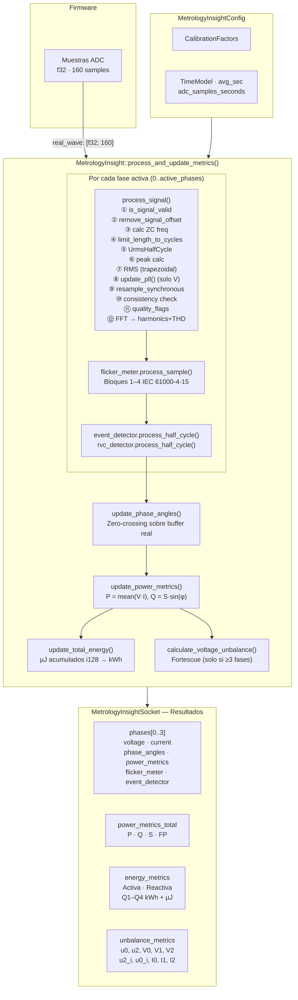
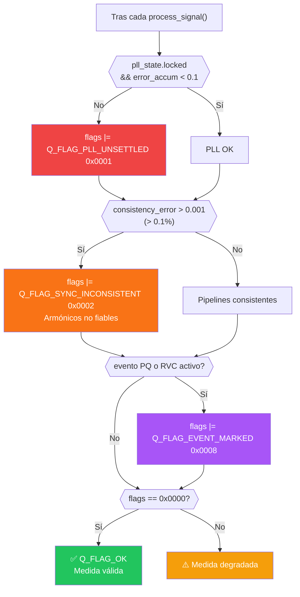

```mermaid
flowchart TD
    A["Firmware deposita\nphases[i].voltage.real_wave\nphases[i].current.real_wave"] --> B["process_and_update_metrics()"]
    B --> LOOP["Para cada fase 0..active_phases"]
    
    subgraph PHASE["Procesamiento por fase (V y luego I)"]
        direction TB
        P1["process_signal(target, ref_freq, delay, config, cache)"]
        P2{{"is_signal_valid?\nAmplitud ≥ config.min_amplitude"}}
        P3["remove_signal_offset()"]
        P4["calculate_zero_crossing_freq()\n(solo si calc_freq=true)"]
        P5["limit_length_to_cycles()"]
        P6["UrmsHalfCycle por muestra\n→ half_cycle_trigger en ZC"]
        P7["calculate_rms()\nTrapezoidal + fracción"]
        P8{{"¿Es tensión?"}}
        P9["update_pll()\nDPLL + PI + VCO"]
        P10["resample_synchronous_into()\n512 pts · 10 ciclos"]
        P11["Verificar consistencia\nconsistency_error"]
        P12["quality_flags"]
        P13["Si sync_len≥512:\ncompute_harmonics_and_thd()\nFFT → bins → THD"]
        P14["update_average()\nrms, peak, harmonics, thd"]
        
        P1 --> P2
        P2 -- No --> SKIP["Señal ignorada"]
        P2 -- Sí --> P3 --> P4 --> P5 --> P6 --> P7 --> P8
        P8 -- Sí --> P9 --> P10
        P8 -- No --> P10
        P10 --> P11 --> P12 --> P13 --> P14
    end

    LOOP --> PHASE

    PHASE --> FLICKER["flicker_meter.process_sample()\nIEC 61000-4-15 Blocks 1-4"]
    FLICKER --> EVT["event_detector.process_half_cycle()\n+ rvc_detector.process_half_cycle()"]
    EVT --> QF["quality_flags |= Q_FLAG_EVENT_MARKED\n(si evento activo)"]

    QF --> NEXT["Siguiente fase"]
    NEXT -->|"última fase"| ANG["update_phase_angles()\nZC → φ = θI − θV"]
    ANG --> POW["update_power_metrics()\nP=mean(VI) Q=S·sin(φ)"]
    POW --> EN["update_total_energy()\nAcumular µJ por cuadrante"]
    EN --> UB["Si ≥3 fases:\ncalculate_voltage_unbalance()\n+ calculate_current_unbalance()\nFortescue V/I"]
```

# Metrology Insight — Documentación Técnica Completa

## Índice

1. [Visión General](#1-visión-general)
2. [Arquitectura del Sistema](#2-arquitectura-del-sistema)
3. [Pipeline de Procesamiento](#3-pipeline-de-procesamiento)
4. [Módulos](#4-módulos)
5. [Constantes de Sistema](#5-constantes-de-sistema)
6. [Banderas de Calidad (Quality Flags)](#6-banderas-de-calidad-quality-flags)
7. [Features y Portabilidad](#7-features-y-portabilidad)
8. [Guía de Integración con Firmware](#8-guía-de-integración-con-firmware)
9. [Dependencias](#9-dependencias)

---

## 1. Visión General

`metrology_insight` es una librería de metrología eléctrica de alto rendimiento para sistemas embebidos multi-plataforma, diseñada para cumplir con los requisitos de la clase S de la norma **IEC 61000-4-30:2021** y **IEC 62053-21**.

> [!NOTE]
> **Alcance de Cumplimiento IEC:** La librería proporciona una implementación software completa para los métodos de medición de calidad de energía Clase S (IEC 61000-4-30:2021), procesamiento de Flicker (IEC 61000-4-15) y medición de energía activa/reactiva en 4 cuadrantes (IEC 62053-21 / IEC 62053-23).

Proporciona un pipeline completo de procesamiento de señal eléctrica desde muestras ADC raw (`f32`) hasta métricas de calidad de red: RMS, potencia activa/reactiva/aparente, factor de potencia, armónicos hasta el orden 50, THD, energía por cuadrante (kWh), ángulos de fase, flicker Pst/Plt (IEC 61000-4-15), detección de eventos (Dip/Swell/Interruption), cambios rápidos de tensión (RVC), desequilibrio por componentes simétricas de Fortescue y banderas de calidad.

**Características principales:**

- Soporte de 1 a 4 fases (monofásico, monofásico con neutro, trifásico 3 hilos, trifásico 4 hilos)
- PLL (Phase-Locked Loop) de alta inercia para seguimiento preciso de frecuencia (IEC 61000-4-30 §5.1)
- Remuestreo síncrono mediante interpolación lineal sobre 10 ciclos (512 puntos)
- FFT sobre 10 ciclos síncronos con `realfft` (512 puntos)
- Flickermeter IEC 61000-4-15: Bloques 1–4 con filtros IIR + ponderación, histograma logarítmico para Pst y cálculo Plt
- Detector de eventos de calidad (Dip/Swell/Interruption) con histéresis por semiciclo (EN 50160)
- Detector de cambios rápidos de tensión (RVC) con seguimiento de estado estable EMA
- Componentes simétricas de Fortescue para desequilibrio (u2, u0)
- Acumuladores de energía en micro-Julios (i128) para máxima precisión (IEC 62053-21)
- Verificación cruzada de consistencia entre pipeline raw y pipeline síncrono
- Sistema de alarmas configurable (`DetectorManager`) con umbral, histéresis y debounce
- Sin dependencias de hardware (agnóstica al ADC)
- Tipos `f32` optimizados para hardware sin FPU doble precisión (compatible con `no_std` + `alloc`)

---

## 2. Arquitectura del Sistema

```
MetrologyInsight
├── config: MetrologyInsightConfig
│   ├── avg_sec                  — Constante de media exponencial (EWMA)
│   ├── adc_samples_seconds      — Frecuencia de muestreo ADC (ej: 7812.5 Hz)
│   ├── adc_samples_per_cycle    — Muestras por ciclo (ej: 156.25 para 50 Hz)
│   ├── nominal_freq             — Frecuencia nominal (50.0 / 60.0)
│   ├── calibration: CalibrationFactors
│   ├── time_model: TimeModel
│   ├── pll: PllConfig           — Ganancias PI, rango, lock, norm, clamp
│   ├── event_config: PqEventConfig  — Umbrales huecos/sobretensiones/interrupciones
│   ├── rvc_config: RvcConfig    — Cambio rápido de tensión
│   ├── flicker: FlickerConfig   — Parámetros IEC 61000-4-15 Bloques 1–4
│   ├── phase: PhaseConfig       — Dead-band clasificación Inductivo/Capacitivo
│   └── signal: SignalConfig     — Umbrales calidad de señal y PLL
│
└── socket: MetrologyInsightSocket
    ├── phases: [PhaseData; 4]        — Hasta 4 fases (A, B, C, Neutro)
    │   └── PhaseData
    │       ├── voltage: MetrologyInsightSignal
    │       ├── current: MetrologyInsightSignal
    │       ├── phase_angles: PhaseAngleMetrics
    │       ├── power_metrics: PowerMetrics
    │       ├── flicker_meter: FlickerMeter    — Pst/Plt IEC 61000-4-15
    │       ├── event_detector: PowerQualityEventDetector
    │       └── rvc_detector: RvcDetector
    ├── power_metrics_total: PowerMetrics   — Suma de todas las fases
    ├── energy_metrics: EnergyMetrics
    │   ├── active: ActiveEnergyMetrics     — Q1–Q4 en kWh + µJ
    │   └── reactive: ReactiveEnergyMetrics — Q1–Q4 en kVArh + µJ
    └── unbalance_metrics: UnbalanceMetrics — Desequilibrio Fortescue (u0, u2)
```




---

## 3. Pipeline de Procesamiento

Al llamar a `MetrologyInsight::process_and_update_metrics(active_phases)`:

```
process_and_update_metrics(active_phases):
│
├── if fft_cache is None → FftCache::new(FFT_RESOLUTION)
│
├── Para cada fase i (0..active_phases):
│   │
│   ├── Fases 0..2 (A, B, C):
│   │   ├── process_signal(voltage, 0.0, 0.0, config, fft_cache)
│   │   │   ├── is_signal_valid() — Validación amplitud mínima
│   │   │   ├── remove_signal_offset() — Eliminar DC
│   │   │   ├── calculate_zero_crossing_freq() (si calc_freq)
│   │   │   ├── calculate_nominal_frequency() → 50/60 Hz
│   │   │   ├── limit_length_to_cycles()
│   │   │   ├── UrmsHalfCycle por muestra + half_cycle_trigger
│   │   │   ├── peak = max(real_wave)
│   │   │   ├── calculate_rms() — Integración trapezoidal + fraccional
│   │   │   ├── update_pll() — DPLL + PI + VCO (solo tensión)
│   │   │   ├── resample_synchronous_into() → sync_buffer[512]
│   │   │   ├── consistency_error = |rms - rms_sync| / rms
│   │   │   ├── quality_flags (PLL_UNSETTLED / SYNC_INCONSISTENT)
│   │   │   ├── compute_harmonics_and_thd() — FFT → bins → THD
│   │   │   └── update_average() — EWMA rms, peak, harmonics, thd
│   │   │
│   │   ├── flicker_meter.process_sample(v, fs) — para cada sample
│   │   │
│   │   ├── event_detector.process_half_cycle(urms_half, frame_ns, config)
│   │   │
│   │   ├── rvc_detector.process_half_cycle(urms_half, frame_ns, config)
│   │   │
    │   │   ├── Si event_detector o rvc_detector activo → Q_FLAG_EVENT_MARKED
    │   │   │   en voltage y current
│   │   │
│   │   └── process_signal(current, v_freq_pll, phase_delay_us, config, fft_cache)
│   │
│   └── Fase 3 (Neutral):
│       ├── RMS simple sobre raw (sin PLL, sin remuestreo, sin armónicos)
│       └── update_average(rms)
│
├── update_phase_angles(socket, adc_samples_seconds, active_phases)
│   └── Zero-crossing rising → v_angle, c_angle, c2v_angle → direction
│
├── update_power_metrics(socket, active_phases)
│   ├── real_power = mean(V×I)
│   ├── apparent_power = Vrms × Irms
│   ├── reactive_power = S × sin(φ)
│   ├── power_factor = P/S (clamped)
│   └── Totales: P_total, Q_total, S_total, PF_total
│
├── update_total_energy(socket, adc_samples_seconds, active_phases)
│   ├── delta_µJ = |P| × elapsed_s × 1_000_000
│   ├── active_energy_by_quadrant()
│   ├── reactive_energy_by_quadrant()
│   └── Conversión µJ → kWh
│
    ├── Si active_phases ≥ 3:
    │   ├── calculate_voltage_unbalance(v_rms[3], v_angles[3])
    │   │   └── Fortescue: V0, V1, V2 → u2%, u0%
    │   └── calculate_current_unbalance(i_rms[3], i_angles[3])
    │       └── Fortescue: I0, I1, I2 → u2( corriente)%, u0( corriente)%
```




---

## 4. Módulos

### 4.1 `types` — Tipos y estructuras principales

#### Constantes

| Constante | Valor | Descripción |
|-----------|-------|-------------|
| `FREQ_NOMINAL_50` | `50.0` | Frecuencia nominal 50 Hz |
| `FREQ_NOMINAL_60` | `60.0` | Frecuencia nominal 60 Hz |
| `ADC_SAMPLES_50HZ_CYCLE` | `160.0` | Muestras/ciclo a 50 Hz (fs=8000 Hz) |
| `ADC_SAMPLES_60HZ_CYCLE` | `133` | Muestras/ciclo a 60 Hz |
| `NUMBER_HARMONICS` | `50` | Armónicos calculados (1.º al 50.º) |
| `MAX_SIGNAL_SAMPLES` | `160` | Tamaño máximo del buffer de señal |
| `Q_FLAG_OK` | `0x0000` | Sin anomalías |
| `Q_FLAG_PLL_UNSETTLED` | `0x0001` | PLL no estable |
| `Q_FLAG_SYNC_INCONSISTENT` | `0x0002` | Inconsistencia raw/sync |
| `Q_FLAG_OUT_OF_RANGE` | `0x0004` | Saturación/clipping ADC |
| `Q_FLAG_EVENT_MARKED` | `0x0008` | Evento PQ o RVC activo |

#### `MetrologyInsight` — Punto de entrada

```rust
pub struct MetrologyInsight {
    pub socket: MetrologyInsightSocket,
    pub config: MetrologyInsightConfig,
    pub fft_cache: Option<FftCache>,
    pub active_phases: usize,
}

impl MetrologyInsight {
    /// Construye la instancia y propaga config a sub-componentes automáticamente.
    pub fn new(config: MetrologyInsightConfig) -> Self

    /// Propaga self.config.flicker.nominal_voltage a todos los FlickerMeter.
    /// Llamar tras modificar self.config en runtime.
    pub fn apply_config(&mut self)

    /// Actualiza nominal_voltage en event_config + flicker simultáneamente
    /// y llama a apply_config() automáticamente.
    pub fn set_nominal_voltage(&mut self, voltage_v: f32)

    /// Pipeline completo de proceso de señal y métricas.
    pub fn process_and_update_metrics(&mut self, active_phases: usize)

    /// Imprime informe completo vía log::info!
    pub fn print_metrology_report(&mut self)
}
```

#### `MetrologyInsightConfig`

```rust
pub struct MetrologyInsightConfig {
    pub avg_sec: f32,                 // Constante de promediado EWMA
    pub adc_samples_seconds: f32,     // Frecuencia de muestreo ADC (Hz)
    pub adc_samples_per_cycle: f64,   // Muestras por ciclo (ej: 156.25)
    pub num_harmonics: usize,         // Nº de armónicos (no usado internamente)
    pub calibration: CalibrationFactors,
    pub time_model: TimeModel,
    pub nominal_freq: f32,            // 50.0 ó 60.0
    pub min_amplitude_voltage: f32,   // Umbral validación tensión (default 10.0)
    pub min_amplitude_current: f32,   // Umbral validación corriente (default 0.001)
    pub pll: PllConfig,
    pub event_config: PqEventConfig,
    pub rvc_config: RvcConfig,
    pub flicker: FlickerConfig,
    pub phase: PhaseConfig,
    pub signal: SignalConfig,
}

impl Default for MetrologyInsightConfig {
    // avg_sec: 0.0
    // adc_samples_seconds: 7812.5
    // adc_samples_per_cycle: 156.25
    // num_harmonics: NUMBER_HARMONICS (50)
    // nominal_freq: FREQ_NOMINAL_50 (50.0)
    // min_amplitude_voltage: 10.0
    // min_amplitude_current: 0.001
    // pll: PllConfig::default()
    // event_config: PqEventConfig::default()
    // rvc_config: RvcConfig::default()
    // flicker: FlickerConfig::default()
    // phase: PhaseConfig::default()
    // signal: SignalConfig::default()
}
```

#### `PllConfig`

```rust
pub struct PllConfig {
    pub kp: f32,               // Ganancia proporcional (default 0.002)
    pub ki: f32,               // Ganancia integral (default 0.00005)
    pub freq_min: f32,         // Límite inferior VCO (default 40.0 Hz)
    pub freq_max: f32,         // Límite superior VCO (default 60.0 Hz)
    pub lock_threshold: f32,   // EWMA error < threshold → locked (default 0.5)
    pub norm_threshold: f32,   // Amplitud mínima normalización (default 0.001)
    pub integrator_clamp: f32, // Anti-windup integrador (default 0.1)
    pub lock_ema_alpha: f32,   // Alpha EMA error de lock (default 0.01)
}
```

#### `FlickerConfig`

```rust
pub struct FlickerConfig {
    pub nominal_voltage: f32,      // Tensión nominal (V) — default 230.0
    pub rms_tc_seconds: f32,       // TC IIR RMS largo plazo (~60 s)
    pub smooth_tc_seconds: f32,    // TC suavizado Block 4 (300 ms)
    pub seed_threshold_sq: f32,    // Umbral V² para sembrar avg_rms (10.0)
    pub min_rms_guard: f32,        // RMS mínimo guard división por cero (1.0)
    pub pst_min_samples: u32,      // Muestras mínimas antes de Pst (100)
}
```

#### `PhaseConfig`

```rust
pub struct PhaseConfig {
    pub direction_deadband_deg: f32, // ±deg → InPhase (default 0.5°)
}
```

#### `SignalConfig`

```rust
pub struct SignalConfig {
    pub half_cycle_min_factor: f32,       // Fracción mínima de ciclo (0.4)
    pub rms_consistency_min_guard: f32,   // RMS mínimo consistency_error (1e-6)
    pub pll_error_accum_threshold: f32,   // Umbral PLL_UNSETTLED (0.1)
    pub sync_consistency_threshold: f32,  // Umbral SYNC_INCONSISTENT (0.001)
}
```

#### `PqEventConfig`

```rust
pub struct PqEventConfig {
    pub nominal_voltage: f32,         // Default 230.0 V
    pub dip_threshold_pct: f32,       // Default 90.0%
    pub swell_threshold_pct: f32,     // Default 110.0%
    pub interrupt_threshold_pct: f32, // Default 10.0%
    pub hysteresis_pct: f32,          // Default 1.0%
}
```

#### `RvcConfig`

```rust
pub struct RvcConfig {
    pub threshold_pct: f32,           // Default 3.0%
    pub hysteresis_pct: f32,          // Default 0.5%
    pub min_duration_cycles: u8,      // Default 1
    pub min_valid_voltage_v: f32,     // Default 10.0
    pub steady_state_ema_alpha: f32,  // Default 0.01
}
```

#### `CalibrationFactors`

```rust
pub struct CalibrationFactors {
    pub v_gain: f32,               // Ganancia global de tensión
    pub i_gain: [f32; 3],          // Ganancia por fase A, B, C
    pub phase_offset: [f32; 3],    // Desfase en radianes por fase
    pub phase_delay_us: [f32; 3],  // Retardo de grupo en µs por fase
    pub temp_coeff: f64,           // Coeficiente térmico (PPM/°C)
    pub v_lsb_to_phys: f32,        // Factor LSB → Voltios
    pub i_lsb_to_phys: f32,        // Factor LSB → Amperios
}
```

#### `SystemMode`

```rust
pub enum SystemMode {
    SinglePhase,       // 1 fase: CH0=V, CH1=I — active_phases=1
    SinglePhaseN,      // 1 fase + neutro — active_phases=2
    ThreePhase3Wire,   // 3 fases delta — active_phases=3
    ThreePhase4Wire,   // 3 fases + neutro — active_phases=4
}

impl SystemMode {
    pub const fn active_phases(self) -> usize
    pub const fn has_neutral(self) -> bool
}
```

#### `MetrologyInsightSocket`

```rust
pub struct MetrologyInsightSocket {
    pub phases: [PhaseData; 4],
    pub power_metrics_total: PowerMetrics,
    pub energy_metrics: EnergyMetrics,
    pub unbalance_metrics: UnbalanceMetrics,
}
```

#### `PhaseData`

```rust
pub struct PhaseData {
    pub voltage: MetrologyInsightSignal,
    pub current: MetrologyInsightSignal,
    pub phase_angles: PhaseAngleMetrics,
    pub power_metrics: PowerMetrics,
    pub flicker_meter: FlickerMeter,
    pub event_detector: PowerQualityEventDetector,
    pub rvc_detector: RvcDetector,
}
```

#### `MetrologyInsightSignal` — Señal completa

```rust
pub const MAX_SIGNAL_SAMPLES: usize = 160;

pub struct MetrologyInsightSignal {
    pub real_wave: [f32; MAX_SIGNAL_SAMPLES], // Buffer de muestras físicas
    pub real_wave_len: usize,                 // Longitud real del buffer
    pub length: usize,                        // Longitud total calculada
    pub length_cycle: usize,                  // Muestras en 1 ciclo completo
    pub calc_freq: bool,                      // Calcular frecuencia desde esta señal
    pub peak: f32,                            // Valor pico (EWMA)
    pub rms: f32,                             // RMS (EWMA)
    pub rms_10cycle: f32,                     // RMS sobre 10 ciclos (EN 61000-4-30 §5.2)
    pub cycle_10_sq_sum: f32,                 // Acumulador RMS 10 ciclos
    pub cycle_10_count: u8,                   // Contador RMS 10 ciclos
    pub freq_nominal: f32,                    // Frecuencia nominal (50/60 Hz)
    pub freq_zc: f32,                         // Frecuencia por cruces por cero
    pub harmonics: [f32; NUMBER_HARMONICS],   // Amplitudes armónicas (%)
    pub thd: f32,                             // THD total (%)
    pub sc_thres: f32,                        // Umbral de cortocircuito
    pub signal_type: MetrologyInsightSignalType,
    pub adc_factor: f32,                      // Factor LSB → V_ADC
    pub adc_scale: f32,                       // Escala ADC → unidad física
    pub dc_offset: f32,                       // Componente DC
    pub pll_state: PllState,                  // Estado del PLL
    pub quality_flags: u32,                   // Banderas de calidad
    pub rms_sync: f32,                        // RMS sobre buffer síncrono
    pub consistency_error: f32,               // |rms_raw - rms_sync| / rms
    pub frame_start_ns: u64,                  // Marca de tiempo ktime (ns)
    pub urms_half_cycle: UrmsHalfCycle,       // RMS de semiciclo
}

impl MetrologyInsightSignal {
    pub fn is_current(&self) -> bool
    pub fn real_wave_slice(&self) -> &[f32]
    pub fn push_real_sample(&mut self, val: f32)
    pub fn clear_samples(&mut self)
}
```

#### `MetrologyInsightSignalType`

```rust
pub enum MetrologyInsightSignalType {
    Voltage,
    Current,
}

impl MetrologyInsightSignalType {
    pub fn min_amplitude(&self, config: &MetrologyInsightConfig) -> f32
}
```

#### `PllState`

```rust
pub struct PllState {
    pub phase: f32,              // Fase acumulada oscilador (0..2π)
    pub freq_est: f32,           // Frecuencia estimada actual (Hz)
    pub freq_10s: f32,           // Media 10 s (buffer circular 10 bins de 1s)
    pub integrator: f32,         // Integrador del filtro PI
    pub locked: bool,            // true si error_accum < lock_threshold
    pub error_accum: f32,        // Error acumulado (EWMA)
    pub freq_buf: [f32; 10],     // Buffer circular bins de 1s
    pub freq_buf_idx: usize,     // Índice actual en freq_buf
    pub freq_buf_count: usize,   // Nº de bins válidos
    pub cycle_freq_sum: f32,     // Suma acumulada para bin de 1s
    pub cycle_freq_count: usize, // Contador para bin de 1s
}
```

**Frecuencia media 10 s (IEC 61000-4-30 §5.1):**
El PLL acumula sumas de `freq_est` durante `nominal_freq.round()` muestras (ej: 50 por segundo a 50 Hz). Al completar 1 segundo, almacena el promedio en el buffer circular de 10 slots. `freq_10s` es la media de los slots válidos.

```
Algoritmo por muestra:
1. input_norm = signum(sample) si |sample| > cfg.norm_threshold, sino 0.0
2. phase_error = -sin(phase) × input_norm
3. integrator += cfg.ki × phase_error [clamped ±cfg.integrator_clamp]
4. freq_corr = cfg.kp × phase_error + integrator
5. freq_est = nominal_freq + freq_corr [clamped freq_min..freq_max]
6. phase += 2π × freq_est × ts
7. if phase > 2π → phase -= 2π
Post-ciclo:
8. error_accum = error_accum × (1-alpha) + |nominal - freq_est| × alpha
9. locked = error_accum < cfg.lock_threshold
10. Acumular en bin 1s → freq_10s
```

#### `PowerMetrics`

```rust
pub struct PowerMetrics {
    pub real_power: f32,      // Potencia activa (W)
    pub reactive_power: f32,  // Potencia reactiva (VAR)
    pub apparent_power: f32,  // Potencia aparente (VA)
    pub power_factor: f32,    // Factor de potencia [-1.0, 1.0]
}
```

#### `PhaseAngleMetrics`

```rust
pub enum PhaseDirection {
    Inductive,
    Capacitive,
    InPhase,
}

pub struct PhaseAngleMetrics {
    pub c2v_angle: f32,            // Ángulo corriente→tensión φ = θI − θV (°, firmado)
    pub v_angle: f32,              // Ángulo absoluto tensión (0–360°)
    pub c_angle: f32,              // Ángulo absoluto corriente (0–360°)
    pub direction: PhaseDirection, // Inductivo | Capacitivo | InPhase
}

impl PhaseAngleMetrics {
    pub fn direction_description(&self) -> &'static str
}
```

> **Convención de signo:** `c2v_angle = θI − θV`.
> - `> +deadband` → **Inductivo** (corriente retrasada).
> - `< -deadband` → **Capacitivo** (corriente adelantada).
> - Dentro del dead-band (`PhaseConfig::direction_deadband_deg`) → **InPhase**.
> - Dead-band por defecto: ±0.5°.
> - Técnica: cruce ascendente por cero sobre buffer real (`real_wave`).

#### `EnergyMetrics`

```rust
pub struct ActiveEnergyMetrics {
    pub imported: f64,          // Q1+Q4 (kWh, computado en getter)
    pub exported: f64,          // Q2+Q3 (kWh)
    pub balance: f64,           // imported - exported (kWh)
    pub q1, q2, q3, q4: f64,   // Por cuadrante (kWh)
    pub q1_uj..q4_uj: i128,    // Acumuladores internos (µJ)
}

impl ActiveEnergyMetrics {
    pub fn imported(&self) -> f64
    pub fn exported(&self) -> f64
    pub fn balance(&self) -> f64
}

pub struct ReactiveEnergyMetrics {
    pub capacitive: f64,        // Q2+Q4 (kVArh)
    pub inductive: f64,         // Q1+Q3 (kVArh)
    pub balance: f64,
    pub q1..q4: f64,
    pub q1_uj..q4_uj: i128,
}

impl ReactiveEnergyMetrics {
    pub fn inductive(&self) -> f64
    pub fn capacitive(&self) -> f64
    pub fn balance(&self) -> f64
}
```

Acumulación en µJ (i128): `delta_uj = |P| × elapsed_time × 1_000_000`
Conversión: `kWh = µJ × 1/(3.6 × 10⁹)`

#### `TimeModel`

```rust
pub struct TimeModel {
    pub utc_at_boot_ns: u64,
    pub ktime_at_boot_ns: u64,
    pub drift_factor: f32,
    pub last_calibration_ktime_ns: u64,
}

impl TimeModel {
    pub fn ktime_to_utc(&self, ktime_ns: u64) -> u64
    pub fn init_from_system(utc_now_ns: u64, ktime_now_ns: u64) -> Self
    pub fn recalibrate(&mut self, utc_new_ns: u64, ktime_new_ns: u64)
}
```

#### `PqAggregationRecord`

```rust
#[repr(C, packed)]
pub struct PqAggregationRecord {
    pub timestamp_ms: u64,
    pub aggregation_type: u8,       // 0=3s, 1=10min, 2=2h
    pub v_rms: [f32; 3],
    pub i_rms: [f32; 3],
    pub frequency: f32,
    pub v_peak: [f32; 3],
    pub i_peak: [f32; 3],
    pub active_power: f32,
    pub reactive_power: f32,
    pub apparent_power: f32,
    pub power_factor: f32,
    pub active_energy_imp: f32,
    pub active_energy_exp: f32,
    pub flicker: [f32; 3],
    pub flicker_pst: [f32; 3],
    pub v_rms_10cycle: [f32; 3],
    pub freq_10s: f32,
    pub u2_unbalance: f32,
    pub u0_unbalance: f32,
    // Desequilibrio de corriente (§5.13.6)
    pub u2_i_ratio_pct: f32,
    pub u0_i_ratio_pct: f32,
    pub i0_zero_seq: f32,
    pub i1_pos_seq: f32,
    pub i2_neg_seq: f32,
    // Índices de calidad — max/min por ventana (§B.4)
    pub v_rms_min: [f32; 3],
    pub v_rms_max: [f32; 3],
    pub freq_min: f32,
    pub freq_max: f32,
    // Conteo de eventos — acumulados (delta por período calculado por el consumidor)
    pub dip_count: u32,
    pub swell_count: u32,
    pub interrupt_count: u32,
    pub rvc_count: u32,
    pub v_thd: [f32; 3],
    pub i_thd: [f32; 3],
    pub clean_windows: u16,          // Ventanas de 10/12 ciclo limpias (§4.5.2)
    pub total_windows: u16,          // Total de ventanas en el intervalo
    pub rvc_delta_u_max_pct: [f32; 3],  // ΔUmax por fase (§5.11)
    pub rvc_delta_u_ss_pct: [f32; 3],  // ΔUss por fase (§5.11)
    pub padding: [u8; 3],           // Relleno para 256 bytes exactos
}

impl PqAggregationRecord {
    pub fn empty() -> Self
    pub fn to_bytes(&self) -> [u8; 256]
    pub fn from_bytes(bytes: &[u8; 256]) -> Self
}
```

---

### 4.2 `channel_map` — Mapeado ADC → Fases lógicas

Mapeado de los 8 canales físicos del ADS131M08 a pares tensión/corriente por fase.

**Mapa por defecto:**
`CH0=VA, CH1=IA, CH2=VB, CH3=IB, CH4=VC, CH5=IC, CH6=IN, CH7=VN`

```rust
pub enum ChannelType {
    VoltageA=0, CurrentA=1, VoltageB=2, CurrentB=3,
    VoltageC=4, CurrentC=5, VoltageN=6, CurrentN=7,
}

pub enum Phase { A, B, C, Neutral }

pub struct PhasePair {
    pub voltage_channel: usize,
    pub current_channel: usize,
    pub phase: Phase,
}

pub struct SignalInversion {
    pub invert_voltage: bool,
    pub invert_current: bool,
}

pub const DEFAULT_CHANNEL_MAP: [ChannelType; 8]
pub fn default_phase_pairs() -> [PhasePair; 4]
pub fn phase_pairs_for_mode(mode: SystemMode) -> &'static [PhasePair; 4]
pub fn channel_map_to_pairs(map: &[ChannelType; 8]) -> [PhasePair; 4]
```

---

### 4.3 `processing` — Orquestador del pipeline

Métodos implementados directamente en `MetrologyInsight`. Ver sección 3 para el diagrama completo.

```rust
/// Pipeline completo:
///   1. process_signal() para V e I de cada fase activa (A, B, C con pipeline completo;
///      neutro con RMS simplificado)
///   2. FlickerMeter.process_sample() por sample de tensión
///   3. EventDetector + RvcDetector.process_half_cycle() por semiciclo
///   4. update_phase_angles()
///   5. update_power_metrics()
///   6. update_total_energy()
///   7. calculate_voltage_unbalance() si active_phases ≥ 3
pub fn process_and_update_metrics(&mut self, active_phases: usize)

/// Imprime informe completo vía log::info!
pub fn print_metrology_report(&mut self)
```

---

### 4.4 `signal` — Motor de procesamiento de señal

```rust
// PÚBLICAS
pub fn remove_signal_offset(signal: &mut [f32])
pub fn update_average(in_value: f32, out_value: &mut f32, avg: f32)
pub fn signal_integrate(s: &[f32], frequency_zc: f32, adc_samples_second: f32) -> Vec<f32>

pub fn process_signal(
    target:  &mut MetrologyInsightSignal,
    reference_freq_zc: f32,   // 0.0 para V, freq PLL para I
    phase_delay_us: f32,
    config: &MetrologyInsightConfig,
    fft_cache: &mut FftCache,
)

// INTERNAS (privadas)
// is_signal_valid(signal, type, config)     — Valida amplitud mínima
// is_frequency_in_tolerance(freq, nominal)  — [FREQ_TOLERANCE_LOW=0.95, FREQ_TOLERANCE_HIGH=1.07]
// calculate_nominal_frequency(...)          — Detecta 50 o 60 Hz
// calculate_zero_crossing_frequency(...)    — Frecuencia por ZC interpolado
// limit_length_to_cycles(...)              — Recorta a múltiplo exacto del ciclo
```

**Constantes clave de `signal`:**

| Constante | Valor | Descripción |
|-----------|-------|-------------|
| `FREQ_TOLERANCE_HIGH` | `1.07` | Límite superior tolerancia de frecuencia |
| `FREQ_TOLERANCE_LOW` | `0.95` | Límite inferior tolerancia de frecuencia |
| `HALF_CYCLE_MIN_FACTOR` | `0.4` | Fracción mínima de ciclo para semiciclo válido |
| `RMS_CONSISTENCY_MIN_GUARD` | `1e-6` | RMS mínimo antes de consistency_error |
| `SYNC_CONSISTENCY_THRESHOLD` | `0.001` | Umbral Q_FLAG_SYNC_INCONSISTENT |
| `EXTRA_SAMPLES` | `0` | Muestras extra tras limit_length_to_cycles |
| `ZERO_CROSSING_MAX_POINTS` | `3` | Máx. ZC almacenados |
| `FREQ_ZC_DEBOUNCE` | `2` | Debounce ZC (muestras) |

---

### 4.5 `pll` — Phase-Locked Loop digital

PLL de alta inercia con PI digital + VCO, buffer circular de 10 bins para cumplir IEC 61000-4-30 §5.1 (frecuencia media 10 s).

| Parámetro | Valor por Defecto | Descripción |
|-----------|-------------------|-------------|
| `kp` | `0.002` | Ganancia proporcional PI |
| `ki` | `0.00005` | Ganancia integral PI |
| `norm_threshold` | `0.001` | Amplitud mínima normalización error de fase |
| `integrator_clamp` | `±0.1` | Anti-windup del integrador |
| `lock_ema_alpha` | `0.01` | Alpha EMA del error de lock |
| Rango VCO | `40.0..60.0` Hz | Clamping frecuencia estimada |
| Lock threshold | `0.5` | EWMA error absoluto < threshold → locked |
| `PLL_ERROR_ACCUM_THRESHOLD` | `0.1` | Umbral Q_FLAG_PLL_UNSETTLED |

```rust
pub const PLL_NORM_THRESHOLD: f32       // 0.001
pub const PLL_INTEGRATOR_CLAMP: f32     // 0.1
pub const PLL_LOCK_EMA_ALPHA: f32       // 0.01
pub const PLL_ERROR_ACCUM_THRESHOLD: f32 // 0.1
pub const TWO_PI: f32

pub fn update_pll(state: &mut PllState, samples: &[f32], fs: f32, nominal_freq: f32, cfg: &PllConfig)
```


```mermaid
stateDiagram-v2
    [*] --> INIT : freq_est=0.0

    INIT --> TRACKING : freq_est ← nominal_freq

    state TRACKING {
        [*] --> UNSETTLED
        UNSETTLED --> LOCKED : error_accum < 0.5
        LOCKED --> UNSETTLED : error_accum ≥ 0.5
    }

    TRACKING --> SAMPLE_LOOP

    state SAMPLE_LOOP {
        s1 : input_norm = signum(sample) si |sample|>norm_threshold
        s2 : phase_error = −sin(phase)×input_norm
        s3 : integrator += KI×error [clamp ±0.1]
        s4 : freq_corr = KP×error + integrator
        s5 : freq_est = nominal + freq_corr [clamp 40..60]
        s6 : phase += 2π×freq_est×ts
        s1 --> s2 --> s3 --> s4 --> s5 --> s6
    }

    SAMPLE_LOOP --> TRACKING : error_accum = 0.99×accum + 0.01×|nominal−freq_est|
```

---

### 4.6 `resampling` — Interpolación lineal síncrona

Remuestreo síncrono de 10 ciclos a 512 puntos mediante interpolación lineal (no sinc+Kaiser como en la versión anterior del documento). La corrección de retardo de grupo se aplica como desplazamiento de fase en el grid temporal.

| Parámetro | Valor | Descripción |
|-----------|-------|-------------|
| `target_points` | `512` (`FFT_RESOLUTION`) | Puntos de salida |
| `num_cycles` | `10` (`CYCLES_PER_WINDOW`) | Ciclos en la ventana |

```rust
pub fn resample_synchronous_into(
    input: &[f32],
    fs: f32,
    freq_est: f32,
    num_cycles: usize,
    target_points: usize,
    phase_delay_us: f32,
    output: &mut [f32],
) -> usize

pub fn resample_synchronous(
    input: &[f32], fs: f32, freq_est: f32,
    num_cycles: usize, target_points: usize, phase_delay_us: f32,
) -> Vec<f32>
```

```
Algoritmo:
1. step = input.len() / target_points
2. phase_offset = phase_delay_us × 1e-6 × input.len() / target_points
3. Para m = 0..target_points:
     pos = m × step + phase_offset
     idx0 = floor(pos), idx1 = idx0+1
     frac = pos - idx0
     output[m] = input[idx0] + (input[idx1]-input[idx0]) × frac
```

---

### 4.7 `harmonics` — FFT + Análisis armónico

| Constante | Valor | Descripción |
|-----------|-------|-------------|
| `FFT_RESOLUTION` | `512` | Puntos de FFT (y buffer síncrono) |
| `CYCLES_PER_WINDOW` | `10` | Ciclos en ventana de análisis |
| `FFT_MIN_FUNDAMENTAL_MAG` | `1e-4` | Magnitud mínima fundamental para THD |
| `FFT_FUND_SEARCH_BINS` | `3` | Bins adyacentes buscados alrededor del fundamental |
| `NUMBER_HARMONICS` | `50` | Armónicos hasta orden 50 |

Con 10 ciclos síncronos y 512 puntos, el fundamental queda aproximadamente en el bin esperado según la frecuencia real.

```rust
pub struct FftCache {
    r2c: Arc<dyn RealToComplex<f32>>,
    output: Vec<Complex<f32>>,
    scratch: Vec<Complex<f32>>,
    magnitudes: Vec<f32>,
    pub sync_buffer: [f32; FFT_RESOLUTION], // Buffer reutilizable
}

impl FftCache {
    pub fn new(fft_len: usize) -> Self

    /// Calcula armónicos y THD sobre sync_buffer (debe tener FFT_RESOLUTION samples).
    /// Pipeline: remove_mean → FFT real (realfft) → magnitudes → bins
    /// harmonics[i] = mag(bin (i+1)*fund_bin) / fundamental × 100%
    /// thd = sqrt(Σ mag_hk²) / fundamental × 100%
    /// Retorna None si fundamental es ~0 o señal inválida.
    pub fn compute_harmonics_and_thd(
        &mut self, _freq: f32, _fs: f32
    ) -> Option<([f32; NUMBER_HARMONICS], f32)>
}

/// Resampleo lineal auxiliar
pub fn resample_signal(signal: &[f32], new_len: usize) -> Vec<f32>
```

---

### 4.8 `power` — Métricas de potencia

```rust
pub fn update_power_metrics(socket: &mut MetrologyInsightSocket, active_phases: usize)
```

Por fase:
- `real_power` = `mean(V[t] × I[t])` sobre `real_wave`
- `apparent_power` = `V_rms × I_rms`
- `reactive_power` = `apparent_power × sin(φ)` (φ = `c2v_angle`)
- `power_factor` = `P / S` (clamped [-1, 1])

Totales:
- `P_total = ΣP_i`
- `Q_total = ΣQ_i`
- `S_total = sqrt(P²+Q²)`
- `PF_total = P/S`

---

### 4.9 `energy` — Acumulación por cuadrante (IEC 62053-23)

```
Cuadrantes IEC:
        Q+ (Inductiva)
        ↑
 Q2     │     Q1         Activa Importada = Q1+Q4
────────┼────────→ P+    Activa Exportada = Q2+Q3
 Q3     │     Q4         Reactiva Inductiva  = Q1+Q3
        ↓                Reactiva Capacitiva = Q2+Q4
        Q- (Capacitiva)
```

```rust
pub fn update_energy_by_quadrant(socket: &mut MetrologyInsightSocket, adc_samples_second: f64)
pub fn update_total_energy(socket: &mut MetrologyInsightSocket,
                           adc_samples_second: f64, _active_phases: usize)
```

Acumulación en µJ (i128): `delta_uj = |P| × elapsed_time × 1_000_000`
Conversión: `kWh = µJ × 1/(3.6 × 10⁹)`

---

### 4.10 `phase` — Ángulos de fase

```rust
pub const PHASE_DIRECTION_DEADBAND_DEG: f32 // 0.5°

pub fn update_phase_angles(socket: &mut MetrologyInsightSocket,
                           adc_samples_seconds: f32, active_phases: usize)
```

**Técnica principal:** Primer cruce ascendente por cero en `real_wave`:
```
v_angle = sample_index_to_angle(V_zc_index, samples_per_cycle)
c_angle = sample_index_to_angle(I_zc_index, samples_per_cycle)
c2v_angle = θI − θV (normalizado a ±180°)
direction = Inductivo  si c2v_angle > +deadband
          = Capacitivo si c2v_angle < -deadband
          = InPhase    en otro caso
```

Funciones auxiliares (mantenidas para referencia, no usadas en pipeline):
- `phase_angle_from_pf_and_react_power` — basada en FP + Q
- `phase_angle_from_signals` — dot product / acos (no detecta capacitivo)

---

### 4.11 `voltage_current` — RMS con interpolación fraccional

```rust
pub fn calculate_rms(signal: &[f32], length_cycle: usize,
                     frequency: f32, adc_samples_second: f32) -> f32
```

Usa integración trapezoidal con corrección de muestra fraccional (`d_length = (fs/f).fract()`) para evitar error de truncamiento cuando la frecuencia no es múltiplo exacto de la tasa de muestreo.

---

### 4.12 `urms` — RMS de semiciclo (Urms½)

```rust
pub struct UrmsHalfCycle {
    pub urms: f32,  // Último RMS de semiciclo completo
}

impl UrmsHalfCycle {
    pub fn new() -> Self
    pub fn process_sample(&mut self, sample: f32)
    pub fn half_cycle_trigger(&mut self, min_samples: f32) -> bool
}
```

Acumula suma de cuadrados entre cruces por cero. En cada semiciclo completo (superado `min_samples`), publica el RMS del semiciclo anterior + actual y rota los acumuladores.

---

### 4.13 `flicker` — Flickermeter IEC 61000-4-15

Implementa los Bloques 1–4 del flickermeter estándar:

```rust
pub struct FlickerMeter {
    pub p_inst: f32,                 // Instanteous flicker sensation
    pub pst_classifier: PstClassifier,
}

impl FlickerMeter {
    pub fn new() -> Self
    pub fn set_nominal_voltage(&mut self, nominal_v: f32)
    pub fn process_sample(&mut self, v_in: f32, fs: f32)
    pub fn calculate_pst(&self) -> f32
    pub fn reset_pst(&mut self)
}
```

**Pipeline del flickermeter por muestra:**
1. **Block 1:** Normalización Vpu = Vin / (Vrms × √2), con seguimiento IIR de RMS largo plazo (~60 s)
2. **Block 2:** Demodulación Vdemod = Vpu²
3. **Block 3:** HPF 0.05 Hz + Butterworth 6.º orden 35 Hz (SOS Biquad) + Weighting filter (SOS Biquad)
4. **Block 4:** Cuadrado + suavizado IIR 300 ms → P_inst

**Pst Classifier:** Histograma logarítmico de 64 bins → percentiles P0.1, P1, P3, P10, P50 → Pst = sqrt(0.0314·P0.1 + 0.0525·P1 + 0.0657·P3 + 0.2800·P10 + 0.0800·P50)

```rust
pub fn calculate_plt(pst_12_samples: &[f32; 12]) -> f32  // Plt = cbrt(mean(Pst³))
```

**Constantes:**

| Constante | Valor | Descripción |
|-----------|-------|-------------|
| `FLICKER_SEED_THRESHOLD_SQ` | `10.0` | V² mínimo para sembrar avg_rms |
| `FLICKER_RMS_TC_SECONDS` | `60.0` | TC IIR RMS largo plazo (s) |
| `FLICKER_MIN_RMS_GUARD` | `1.0` | RMS mínimo guard |
| `FLICKER_HPF_CUTOFF_HZ` | `0.05` | Corte HPF Block 3 (Hz) |
| `FLICKER_SMOOTH_TC_SECONDS` | `0.3` | TC suavizado Block 4 |
| `FLICKER_PST_MIN_SAMPLES` | `100` | Muestras mínimas antes de Pst |
| `FLICKER_BINS` | `64` | Bins del histograma logarítmico |

---

### 4.14 `events` — Detector de eventos de calidad (Dip/Swell/Interruption)

```rust
pub enum PqEventType { None, Dip, Swell, Interruption }

pub struct PqEventRecord {
    pub event_type: PqEventType,
    pub phase_index: u8,
    pub start_timestamp_ns: u64,
    pub duration_ms: f32,
    pub extremum_v: f32,      // Min V para Dip/Interruption, max V para Swell
    pub reference_v: f32,     // Tensión nominal
    pub is_active: bool,
}

pub struct PowerQualityEventDetector {
    pub active_event: PqEventRecord,
    pub last_completed_event: PqEventRecord,
    pub event_count: u32,
    pub dip_count: u32,
    pub swell_count: u32,
    pub interruption_count: u32,
}

impl PowerQualityEventDetector {
    /// Procesa un semiciclo. Retorna Some(event) cuando el evento finaliza.
    pub fn process_half_cycle(
        &mut self, phase_index: u8, urms_half: f32,
        now_ns: u64, config: &PqEventConfig,
    ) -> Option<PqEventRecord>
}
```

**Umbrales (sobre Urms½):**
- `Interruption`: Urms½ < `Udin × interrupt_threshold_pct/100` (default 10%)
- `Dip`: Urms½ < `Udin × dip_threshold_pct/100` (default 90%)
- `Swell`: Urms½ > `Udin × swell_threshold_pct/100` (default 110%)
- Histéresis configurable (default 1% de Udin)

---

### 4.15 `rvc` — Detector de Cambio Rápido de Tensión (RVC)

```rust
/// Buffer circular de 120 valores Urms(½) para referencia de estado estable (§5.11)
pub struct RvcRecord {
    pub phase_index: u8,
    pub start_timestamp_ns: u64,
    pub end_timestamp_ns: u64,
    pub duration_ms: f32,
    pub delta_u_max_pct: f32,       // Desviación máxima respecto a media pre-evento (%)
    pub delta_u_ss_pct: f32,        // Cambio de estado estable post-evento (%)
    pub steady_state_u: f32,        // Media pre-evento
    pub post_event_u: f32,          // Media post-evento
}

pub struct RvcDetector {
    pub active_rvc: RvcRecord,
    pub last_completed_rvc: RvcRecord,
    pub rvc_count: u32,             // Conteo acumulado de eventos
    pub voltage_stable: bool,       // True si los 120 Urms(½) están dentro de ±umbral respecto a la media
    // Privado: urms_buffer[120], máquina de estados (Init/Ready/Active/Hysteresis)
}

impl RvcDetector {
    pub fn process_half_cycle(
        &mut self, phase_index: u8, urms_half: f32,
        now_ns: u64, config: &RvcConfig,
    ) -> Option<RvcRecord>

    pub fn discard_active(&mut self)  // Descartar si hay dip/swell/interruption

    pub fn is_active(&self) -> bool   // Estado == Active

    pub fn buffer_fill_pct(&self) -> f32  // Progreso de llenado del buffer
}
```

**Máquina de estados:** `Init → Ready → Active → Hysteresis → Ready`
- **Init:** Llena el buffer circular de 120 valores Urms(½)
- **Ready:** Monitorizando. Cuando |desviación| ≥ umbral, transición a Active
- **Active:** Tracking de ΔUmax. Cuando los 120 valores vuelven a ±umbral durante 120 semiciclos consecutivos, el evento termina (se registra ΔUss). Si ocurre dip/swell/interruption, `discard_active()` pasa a Hysteresis sin contar el evento.
- **Hysteresis:** 120 semiciclos de enfriamiento antes de volver a Ready.

**Parámetros (RvcConfig):**
- `threshold_pct`: default 3.0%
- `hysteresis_pct`: default 0.5%
- `min_valid_voltage_v`: default 10 V

---

### 4.16 `unbalance` — Desequilibrio por Componentes Simétricas (Fortescue)

```rust
pub struct UnbalanceMetrics {
    pub v0_zero_seq: f32,       // Magnitud secuencia cero tensión (V)
    pub v1_pos_seq: f32,        // Magnitud secuencia positiva tensión (V)
    pub v2_neg_seq: f32,        // Magnitud secuencia negativa tensión (V)
    pub u2_neg_ratio_pct: f32,  // Desequilibrio tensión sec. negativa u2 (%)
    pub u0_zero_ratio_pct: f32, // Desequilibrio tensión sec. cero u0 (%)
    // Corriente (§5.13.6)
    pub i0_zero_seq: f32,       // Magnitud secuencia cero corriente (A)
    pub i1_pos_seq: f32,        // Magnitud secuencia positiva corriente (A)
    pub i2_neg_seq: f32,        // Magnitud secuencia negativa corriente (A)
    pub u2_i_ratio_pct: f32,    // Desequilibrio corriente sec. negativa u2 (%)
    pub u0_i_ratio_pct: f32,    // Desequilibrio corriente sec. cero u0 (%)
}

pub fn calculate_voltage_unbalance(
    v_rms: &[f32; 3],
    v_angles_deg: &[f32; 3],
) -> UnbalanceMetrics

pub fn calculate_current_unbalance(
    i_rms: &[f32; 3],
    i_angles_deg: &[f32; 3],
) -> UnbalanceMetrics
```

Usa el operador de rotación de Fortescue `a = e^(j·120°)`:
```
V0 = (VA + VB + VC) / 3
V1 = (VA + a·VB + a²·VC) / 3
V2 = (VA + a²·VB + a·VC) / 3
u2 = |V2|/|V1| × 100%
u0 = |V0|/|V1| × 100%
```

---

### 4.17 `detector` — Sistema de Alarmas Configurable

Sistema genérico de detección de alarmas con umbral, histéresis y debounce.

```rust
pub enum Operation { Value, Abs, Gradient, AbsGradient }
pub enum Condition { Gt, GtEq, Lt, LtEq, Eq, NotEq }
pub enum Status { Off, On }

pub struct Detector {
    pub condition: Condition,
    pub status: Status,
    pub th: f32,           // Umbral
    pub hyst: f32,         // Histéresis (%)
    pub debounce_on: u16,
    pub debounce_off: u16,
}

impl Detector {
    pub fn new(condition: Condition, th: f32, hyst_pct: f32, debounce: u16) -> Self
    pub fn process(&mut self, raw_value: f32, update_status: bool) -> (bool, Status)
    pub fn process_with_op(&mut self, raw_value: f32, op: Operation, update_status: bool) -> (bool, Status)
    pub fn reset(&mut self)
}

/// Extrae un valor del socket para una clave (phase, group, element)
pub fn extract_value(socket: &MetrologyInsightSocket, key: ValueKey) -> Option<f32>

pub struct DetectorManager {
    // Hasta 50 slots de detectores
}

impl DetectorManager {
    pub fn new() -> Self
    pub fn create(&mut self, key: ValueKey, op: Operation, condition: Condition,
                  th: f32, hyst_pct: f32, debounce: u16) -> Option<usize>
    pub fn delete(&mut self, id: usize)
    pub fn evaluate<F>(&mut self, socket: &MetrologyInsightSocket, on_event: F)
}
```

`ValueKey` permite monitorizar: RMS, Urms½, frecuencia, THD, ángulo de fase, potencias, energías activa y reactiva por fase y totales.

---

### 4.18 `filters` — Media móvil (portado de metrology-core)

```rust
pub struct MovingAverage<const N: usize>

impl<const N: usize> MovingAverage<N> {
    pub fn new() -> Self
    pub fn push(&mut self, value: f32) -> f32
}

// Uso:
let mut filter = MovingAverage::<8>::new();
let avg = filter.push(230.5_f32);
```

---

### 4.19 `windowing` — Funciones de ventana

```rust
pub fn hann(window: &mut [f32])          // w[i] = 0.5 × (1 − cos(2πi/(N-1)))
pub fn blackman_harris(window: &mut [f32]) // −92 dB sidelobe suppression
```

> Nota: El pipeline de armónicos principal no aplica ventana explícita (el método `remove_mean` se usa antes de FFT). Las funciones de ventana están disponibles para análisis ad-hoc.

---

### 4.20 `generate_signal` — Generación de señales de prueba

```rust
pub const ADC_FULL_SCALE_COUNTS: f32   // = 2^23 = 8388608
pub const VIN_TO_COUNTS: f32            // LSB/V para ADS131M08
pub const AMPS_TO_COUNTS: f32           // LSB/A para ADS131M08

pub fn generate_signals() -> Vec<Vec<i32>>       // 3 fases + neutro
pub fn generate_signals_monophase() -> Vec<Vec<i32>>
```

Genera señales sinusoidales trifásicas (0°, -120°, +120°) con armónicos configurables y ruido, simulando la salida del ADC.

---

### 4.21 `print` — Diagnóstico y logging

```rust
pub fn print_voltage_signal(data: &MetrologyInsightSocket, active: usize)
pub fn print_current_signal(data: &MetrologyInsightSocket, active: usize)
pub fn print_harmonics(data: &MetrologyInsightSocket, active: usize)
pub fn print_power(data: &MetrologyInsightSocket)
pub fn print_phase_angle(data: &MetrologyInsightSocket, active: usize)
pub fn print_interphase_angle(data: &MetrologyInsightSocket, active: usize)
pub fn print_active_energy(data: &MetrologyInsightSocket)
pub fn print_reactive_energy(data: &MetrologyInsightSocket)
pub fn print_all(data: &MetrologyInsightSocket, active_phases: usize)
```

---

### 4.22 `oscillography` — Registrador de oscilografía de transitorios (Waveform Capture)

Proporciona el motor de captura de transitorios de señal a alta velocidad (8000 muestras/segundo). Conserva ciclos antes del fallo (pre-trigger) y después del fallo (post-trigger) de manera continua y eficiente.

#### Constantes y parámetros temporales

| Constante | Valor | Descripción |
|-----------|-------|-------------|
| `PRE_TRIGGER_CYCLES` | `10` | Ciclos almacenados previos al disparo (10 ciclos @ 50 Hz = 200 ms) |
| `POST_TRIGGER_CYCLES` | `50` | Ciclos almacenados posteriores al disparo (50 ciclos @ 50 Hz = 1000 ms) |
| `SAMPLES_PER_CYCLE` | `160` | Muestras por cada ciclo (8000 SPS / 50 Hz) |
| `PRE_TRIGGER_SAMPLES` | `1600` | Muestras totales en el buffer circular de pre-trigger |
| `POST_TRIGGER_SAMPLES` | `8000` | Muestras totales en el buffer lineal de post-trigger |
| `TOTAL_SAMPLES` | `9600` | Muestras totales por cada canal (1.2 segundos a 8 kSPS) |
| `MAX_CHANNELS` | `8` | Número máximo de canales físicos soportados (V L1-L3, VN, I L1-L3, IN) |

#### Estructuras

##### `TriggerSource` — Origen del disparo de captura
Mapea el transitorio a la lógica que originó el disparo de captura:
* `Manual`: Solicitado explícitamente por el usuario a través de la API REST.
* `Dip(u8)`: Disparado por hueco de tensión detectado en la fase indicada.
* `Swell(u8)`: Disparado por sobretensión transitoria en la fase indicada.
* `Interruption(u8)`: Disparado por corte de tensión en la fase indicada.
* `Rvc(u8)`: Disparado por un Cambio Rápido de Tensión (RVC).
* `Alarm(u8)`: Disparado por una regla de alarma activa en el `AlarmManager`.

##### `ChannelBuffer` — Buffer individual de canal
Implementa un buffer circular continuo para las muestras pre-trigger y un buffer secuencial que se activa únicamente al recibir un disparo para el post-trigger.
```rust
pub struct ChannelBuffer {
    pub pre_trigger: [f32; PRE_TRIGGER_SAMPLES],
    pub post_trigger: [f32; POST_TRIGGER_SAMPLES],
    pub pre_write_ptr: usize,
    pub post_write_ptr: usize,
}
```

##### `OscillographyManager` — Administrador del ciclo de vida
Orquesta los canales del sistema de oscilografía y la máquina de estados de captura (`Idle` $\rightarrow$ `Armed` $\rightarrow$ `Capturing` $\rightarrow$ `Ready`).
```rust
pub struct OscillographyManager {
    pub channels: [ChannelBuffer; MAX_CHANNELS],
    pub state: OscillographyState,
    pub trigger_source: Option<TriggerSource>,
    pub trigger_timestamp_ns: u64,
    pub phase_mode: u8,
    pub active_channels: u8,
}
```

---

---

## 5. Constantes de Sistema

### Constantes globales

| Constante | Módulo | Valor | Descripción |
|-----------|--------|-------|-------------|
| `FREQ_NOMINAL_50` | `types` | `50.0` | Frecuencia nominal europea (Hz) |
| `FREQ_NOMINAL_60` | `types` | `60.0` | Frecuencia nominal americana (Hz) |
| `ADC_SAMPLES_50HZ_CYCLE` | `types` | `160.0` | Muestras/ciclo a 50 Hz (fs=8000) |
| `ADC_SAMPLES_60HZ_CYCLE` | `types` | `133` | Muestras/ciclo a 60 Hz |
| `NUMBER_HARMONICS` | `types` | `50` | Armónicos calculados (1.º al 50.º) |
| `MAX_SIGNAL_SAMPLES` | `types` | `160` | Tamaño buffer `real_wave` |
| `FFT_RESOLUTION` | `harmonics` | `512` | Puntos de FFT |
| `CYCLES_PER_WINDOW` | `harmonics` | `10` | Ciclos en ventana de análisis |
| `FFT_MIN_FUNDAMENTAL_MAG` | `harmonics` | `1e-4` | Magnitud mínima fundamental para THD |
| `FFT_FUND_SEARCH_BINS` | `harmonics` | `3` | Bins alrededor del fundamental |
| `ZERO_CROSSING_MAX_POINTS` | `signal` | `3` | Máx. ZC almacenados |
| `FREQ_ZC_DEBOUNCE` | `signal` | `2` | Debounce ZC (muestras) |
| `FREQ_TOLERANCE_HIGH` | `signal` | `1.07` | Tolerancia superior de frecuencia |
| `FREQ_TOLERANCE_LOW` | `signal` | `0.95` | Tolerancia inferior de frecuencia |
| `HALF_CYCLE_MIN_FACTOR` | `signal` | `0.4` | Fracción mínima ciclo para semiciclo |
| `RMS_CONSISTENCY_MIN_GUARD` | `signal` | `1e-6` | RMS mínimo para consistency_error |
| `SYNC_CONSISTENCY_THRESHOLD` | `signal` | `0.001` | Umbral Q_FLAG_SYNC_INCONSISTENT |
| `EXTRA_SAMPLES` | `signal` | `0` | Muestras extra post-trim |

### Constantes PLL

| Constante | Valor | Descripción |
|-----------|-------|-------------|
| `PLL_NORM_THRESHOLD` | `0.001` | Amplitud mínima normalización |
| `PLL_INTEGRATOR_CLAMP` | `0.1` | Anti-windup integrador |
| `PLL_LOCK_EMA_ALPHA` | `0.01` | Alpha EMA error de lock |
| `PLL_ERROR_ACCUM_THRESHOLD` | `0.1` | Umbral Q_FLAG_PLL_UNSETTLED |

### Constantes Flicker

| Constante | Valor | Descripción |
|-----------|-------|-------------|
| `FLICKER_SEED_THRESHOLD_SQ` | `10.0` | V² mínimo para sembrar avg_rms |
| `FLICKER_RMS_TC_SECONDS` | `60.0` | TC IIR RMS largo plazo (s) |
| `FLICKER_MIN_RMS_GUARD` | `1.0` | RMS mínimo guard división por cero |
| `FLICKER_HPF_CUTOFF_HZ` | `0.05` | Corte HPF Block 3 (Hz) |
| `FLICKER_SMOOTH_TC_SECONDS` | `0.3` | TC suavizado Block 4 (300 ms) |
| `FLICKER_PST_MIN_SAMPLES` | `100` | Muestras mínimas antes de Pst |
| `FLICKER_BINS` | `64` | Bins del histograma logarítmico |

### Constantes RVC

| Constante | Valor | Descripción |
|-----------|-------|-------------|
| `RVC_MIN_VALID_VOLTAGE_V` | `10.0` | Tensión mínima válida (V) |
| `RVC_STEADY_STATE_EMA_ALPHA` | `0.01` | Alpha EMA estado estable |

### Constante Phase

| Constante | Valor | Descripción |
|-----------|-------|-------------|
| `PHASE_DIRECTION_DEADBAND_DEG` | `0.5` | Dead-band dirección (grados) |

### Constante Detector

| Constante | Valor | Descripción |
|-----------|-------|-------------|
| `DETECTOR_MAX` | `50` | Nº máximo de slots de detectores |

---

## 6. Banderas de Calidad (Quality Flags)

Bitfield `u32` en `MetrologyInsightSignal::quality_flags`. Referencia: **IEC 61000-4-30 Clase S**.

| Constante | Valor hex | Condición de activación |
|-----------|-----------|-------------------------|
| `Q_FLAG_OK` | `0x0000` | Sin anomalías |
| `Q_FLAG_PLL_UNSETTLED` | `0x0001` | `!locked` ó `error_accum > PLL_ERROR_ACCUM_THRESHOLD (0.1)` |
| `Q_FLAG_SYNC_INCONSISTENT` | `0x0002` | `consistency_error > SYNC_CONSISTENCY_THRESHOLD (0.001)` |
| `Q_FLAG_OUT_OF_RANGE` | `0x0004` | Reservado: saturación / clipping ADC |
| `Q_FLAG_EVENT_MARKED` | `0x0008` | Evento PQ (Dip/Swell/Interruption) o RVC activo |




```rust
use metrology_insight::{
    Q_FLAG_OK, Q_FLAG_PLL_UNSETTLED,
    Q_FLAG_SYNC_INCONSISTENT, Q_FLAG_EVENT_MARKED
};

let flags = insight.socket.phases[0].voltage.quality_flags;

if flags == Q_FLAG_OK {
    // Medida completamente válida
}
if flags & Q_FLAG_PLL_UNSETTLED != 0 {
    // PLL en transitorio, frecuencia no fiable
}
if flags & Q_FLAG_SYNC_INCONSISTENT != 0 {
    // Divergencia > 0.1% entre raw y síncrono. Armónicos no fiables.
}
if flags & Q_FLAG_EVENT_MARKED != 0 {
    // Evento PQ o RVC en curso en esta fase
}
```

---

## 7. Features y Portabilidad

### 7.1 Sistema de Features

El crate usa un sistema de features para funcionar tanto en entornos `std` como `no_std`:

| Feature | ¿Default? | Dependencias que activa | Descripción |
|---------|-----------|------------------------|-------------|
| `std` | ✅ Sí | `realfft`, `rand` (completo), `alloc` | Entorno con `std`. Usa `realfft` para FFT (más flexible). |
| `alloc` | No | — | Entorno sin `std` pero con `alloc`. Usa `microfft` para FFT. Requiere un allocator global. |
| (ninguna) | — | — | Sin `std` ni `alloc`. No hay FFT (THD=0, harmonics=[0;50]), no hay `generate_signal`, no hay `signal_integrate` ni `resample_synchronous` (conveniencia). El pipeline básico (RMS, PLL, potencia, energía, flicker, eventos, RVC, ángulos, desequilibrio) funciona completamente. |

### 7.2 Matriz de funcionalidades por feature

| Módulo / Función | `std` (default) | `alloc` (sin std) | Sin features |
|------------------|----------------|-------------------|--------------|
| FFT Backend | `realfft` | `microfft` | ❌ |
| Armónicos + THD | ✅ | ✅ | ❌ (=0) |
| generate_signal | ✅ (rand) | ✅ (LCG) | ❌ |
| signal_integrate | ✅ | ✅ | ❌ |
| resample_synchronous (Vec) | ✅ | ✅ | ❌ |
| RMS, PLL, Potencia, Energía | ✅ | ✅ | ✅ |
| Flicker (IEC 61000-4-15) | ✅ | ✅ | ✅ |
| Eventos PQ (Dip/Swell) | ✅ | ✅ | ✅ |
| RVC | ✅ | ✅ | ✅ |
| Desequilibrio (Fortescue) | ✅ | ✅ | ✅ |
| Ángulos de fase | ✅ | ✅ | ✅ |
| Filtros (MovingAverage) | ✅ | ✅ | ✅ |

### 7.3 Targets soportados

| Arquitectura | `std` | `alloc` | Sin features |
|-------------|-------|---------|-------------|
| **ESP32 (Xtensa)** vía ESP-IDF | ✅ (recomendado) | N/A | N/A |
| **Cortex-M** (STM32, RP2040, etc.) | ❌ | ✅ | ✅ |
| **RISC-V** (sin OS) | ❌ | ✅ | ✅ |
| **x86_64 / aarch64 Linux** | ✅ | ✅ | ✅ |
| **x86_64 / aarch64 macOS** | ✅ | ✅ | ✅ |
| **WASM** | ✅ | ✅ | ✅ |

### 7.4 Cómo configurar las features

**Para tu proyecto ESP32 (tu caso — no necesitas cambiar nada):**
```toml
# firmware/Cargo.toml — hereda default features
metrology_insight = { path = "../metrology_insight" }
# → std activo por defecto → FFT con realfft, generate_signal con rand
```

**Para un proyecto Cortex-M (no_std + alloc):**
```toml
[dependencies]
metrology_insight = { path = "../metrology_insight", default-features = false, features = ["alloc"] }
```

**Para un proyecto bare-metal sin allocator:**
```toml
[dependencies]
metrology_insight = { path = "../metrology_insight", default-features = false }
# Sin FFT. RMS, PLL, energía, flicker, eventos, etc. funcionan.
```

---

## 8. Guía de Integración con Firmware

### Inicialización

```rust
use metrology_insight::{
    MetrologyInsight, MetrologyInsightConfig, CalibrationFactors,
    SystemMode, MetrologyInsightSignalType,
};

let config = MetrologyInsightConfig {
    avg_sec: 160.0 / 8000.0,     // EWMA 1 ciclo (20 ms a 50 Hz)
    adc_samples_seconds: 8000.0, // fs del ADS131M08
    adc_samples_per_cycle: 160.0,// Para 50 Hz exacto
    calibration: CalibrationFactors {
        v_lsb_to_phys: 0.000_244,
        i_lsb_to_phys: 0.000_050,
        i_gain: [1.0, 1.0, 1.0],
        phase_offset: [0.0, 0.0, 0.0],
        phase_delay_us: [0.0, 0.0, 0.0],
        v_gain: 1.0,
        temp_coeff: 0.0,
    },
    time_model: Default::default(),
    ..MetrologyInsightConfig::default()
};
let mut insight = MetrologyInsight::new(config);

// Tensión nominal (sincroniza event_config + flicker)
insight.set_nominal_voltage(230.0);

let mode = SystemMode::ThreePhase4Wire;
let active_phases = mode.active_phases(); // 4
```

### Configurar señales (una sola vez tras init)

```rust
for i in 0..active_phases {
    insight.socket.phases[i].voltage.signal_type = MetrologyInsightSignalType::Voltage;
    insight.socket.phases[i].voltage.calc_freq   = (i == 0); // Solo fase A calcula freq

    insight.socket.phases[i].current.signal_type = MetrologyInsightSignalType::Current;
}
```

### Loop de medición

```rust
use metrology_insight::channel_map::default_phase_pairs;

loop {
    let pairs = default_phase_pairs();

    // 1. Depositar muestras ADC ya convertidas a f32
    for i in 0..active_phases {
        insight.socket.phases[i].voltage.clear_samples();
        insight.socket.phases[i].current.clear_samples();
        for &sample in &adc_samples_v[i] {
            insight.socket.phases[i].voltage.push_real_sample(sample);
        }
        for &sample in &adc_samples_i[i] {
            insight.socket.phases[i].current.push_real_sample(sample);
        }
    }

    // 2. Ejecutar pipeline completo
    insight.process_and_update_metrics(active_phases);

    // 3. Leer resultados por fase
    let v_rms  = insight.socket.phases[0].voltage.rms;
    let i_rms  = insight.socket.phases[0].current.rms;
    let freq   = insight.socket.phases[0].voltage.pll_state.freq_est;
    let p_real = insight.socket.phases[0].power_metrics.real_power;
    let pf     = insight.socket.phases[0].power_metrics.power_factor;
    let thd_v  = insight.socket.phases[0].voltage.thd;
    let flags  = insight.socket.phases[0].voltage.quality_flags;
    let p_inst = insight.socket.phases[0].flicker_meter.p_inst;
    let event  = insight.socket.phases[0].event_detector.last_completed_event;
    let u2     = insight.socket.unbalance_metrics.u2_neg_ratio_pct;

    // 4. Totales del sistema
    let p_total = insight.socket.power_metrics_total.real_power;
    let q_total = insight.socket.power_metrics_total.reactive_power;
    let e_kwh   = insight.socket.energy_metrics.active.imported;
}
```

### Verificar calidad de medida antes de publicar

```rust
let v = &insight.socket.phases[0].voltage;
let measurement_valid = v.quality_flags == Q_FLAG_OK
                        && v.pll_state.locked
                        && v.consistency_error < 0.001;

if measurement_valid {
    publish_mqtt(&insight.socket);
}
```

### Almacenar registros de agregación PQ

```rust
use metrology_insight::types::PqAggregationRecord;

let record = PqAggregationRecord {
    timestamp_ms: 1234567890000,
    aggregation_type: 0,       // 3s
    v_rms: [
        insight.socket.phases[0].voltage.rms,
        insight.socket.phases[1].voltage.rms,
        insight.socket.phases[2].voltage.rms,
    ],
    frequency: insight.socket.phases[0].voltage.pll_state.freq_est,
    v_thd: [
        insight.socket.phases[0].voltage.thd,
        insight.socket.phases[1].voltage.thd,
        insight.socket.phases[2].voltage.thd,
    ],
    active_power: insight.socket.power_metrics_total.real_power,
    reactive_power: insight.socket.power_metrics_total.reactive_power,
    apparent_power: insight.socket.power_metrics_total.apparent_power,
    power_factor: insight.socket.power_metrics_total.power_factor,
    active_energy_imp: insight.socket.energy_metrics.active.imported as f32,
    u2_unbalance: insight.socket.unbalance_metrics.u2_neg_ratio_pct,
    ..PqAggregationRecord::empty()
};

let bytes: [u8; 256] = record.to_bytes();
// Almacenar en flash...
```

---

## 9. Dependencias

| Crate | Versión | Feature requerida | Uso |
|-------|---------|-------------------|-----|
| `libm` | `0.2` | siempre | Funciones matemáticas `no_std` (cosf, sinf en windowing) |
| `log` | `0.4` | siempre | Logging en módulo `print` y `voltage_current` |
| `microfft` | `0.6` | `alloc` (o `std`) | FFT no_std para armónicos cuando no hay `realfft` |
| `num-complex` | `0.4` | `std` | Tipo `Complex<f32>` para `realfft` y componentes simétricas |
| `rand` | `0.10` | `std` (opcional) | Generación aleatoria (`generate_signal` en modo `std`) |
| `realfft` | `3.5` | `std` (opcional) | FFT real optimizada para `std` — pipeline principal de armónicos |
| `serde` | `1.0` | siempre | Serialización (`SystemMode`, `PqEventType`, `PqAggregationRecord`, `UnbalanceMetrics`) |

**Nota:** Con `std` desactivado, `num-complex` se sigue usando de forma indirecta a través de `microfft`.
